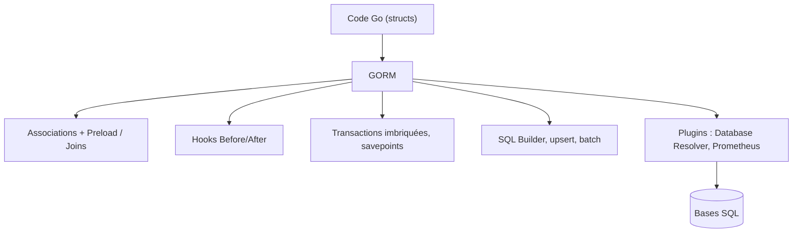

# go-gorm/gorm

> ORM Go complet : associations, hooks, transactions imbriquées, migrations automatiques.

## Le problème
Écrire du SQL à la main en Go pour chaque table et chaque relation produit du code répétitif
et fragile aux changements de schéma.

## Ce que ça fait vraiment
Couvre les associations (has one, has many, belongs to, many to many, polymorphisme, héritage
sur table unique) et les hooks avant/après création, sauvegarde, mise à jour, suppression, lecture.
Charge les relations avec `Preload` et `Joins`. Gère transactions, transactions imbriquées,
points de sauvegarde et retour à un point donné.
Fournit contexte, mode requête préparée, mode DryRun, insertion par lots, `FindInBatches`,
constructeur SQL, upsert, verrouillage, hints d'optimiseur et d'index, arguments nommés.
Clés primaires composites, migrations automatiques, logger, et une API de plugins extensible
(résolveur de base pour multi-bases et séparation lecture/écriture, Prometheus).

## Comment c'est branché


## Essayer
```bash
# Aucune commande d'installation dans le README : il renvoie à gorm.io.
```

## Coût et pièges
Gratuit. Le README ne dit rien des bases supportées ni des prérequis : tout est renvoyé au site.
Aucune version minimale de Go n'est indiquée.

## Ce que ce n'est pas
Ce n'est pas documenté ici : le README tient en une liste de fonctionnalités et deux liens,
ce qui interdit toute évaluation sérieuse depuis le dépôt seul. Ce n'est pas un générateur de code,
mais un projet compagnon `Gen` existe et a ses propres guides.

## Alternatives
- **Gen** : projet compagnon cité, avec ses propres guides.

## Pour toi
Hors périmètre data/IA, sauf si tu écris un service Go autour de tes modèles.
