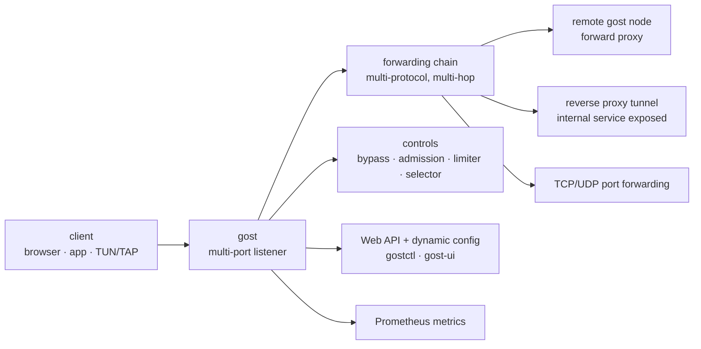

# go-gost/gost

> **A single Go binary acting as proxy, port forwarder and reverse tunnel, chaining protocols together.**

## The problem

Exposing a service from a private network, crossing a firewall or relaying traffic through
several hops usually means stacking unrelated tools: a SOCKS proxy here, an `ssh -R` there,
an HTTP reverse proxy somewhere else, each with its own configuration, protocols and access
rules. Nothing composes, and control over what passes through — routing, quotas,
authorisation — has to be reinvented at every layer.

## What it actually does

GOST — *GO Simple Tunnel* — is a single binary covering the three roles the README states:
**forward proxy** (acting as a proxy for network access), **port forwarding** (mapping one
service's port onto another's) and **reverse proxy** (exposing an internal service to the
public internet through a tunnel). In all three cases the claimed common ground is the
*multi-level forwarding chain*: several protocols composed in sequence to form the path.

The README's feature list is a set of checkboxes, each linking to the `gost.run` documentation
site: multi-port listening, multi-protocol support, TCP/UDP port forwarding, TCP/UDP
transparent proxying, DNS resolution and DNS proxying, TUN/TAP devices and TUN2SOCKS, load
balancing, routing control (*bypass*), admission control, rate limiting, a plugin system,
Prometheus metrics, dynamic configuration and a Web API. Two interfaces are maintained
separately: `go-gost/gostctl` (GUI) and `go-gost/gost-ui` (WebUI).

What the README does **not** do: it gives no configuration example and no usage command line.
Every operational detail lives outside the repository, on `gost.run`.

## How it is wired



No code-derived diagram exists for this repository: this one is rebuilt from the README alone,
following the three overview pictures it shows (proxy, forward, reverse proxy) plus the
concepts named in the feature list.

## Trying it

The README documents installation only, never usage. The four routes it gives:

```bash
# install the latest release
bash <(curl -fsSL https://github.com/go-gost/gost/raw/master/install.sh) --install
```

```bash
# pick the version to install
bash <(curl -fsSL https://github.com/go-gost/gost/raw/master/install.sh)
```

```
git clone https://github.com/go-gost/gost.git
cd gost/cmd/gost
go build
```

```
docker run --rm gogost/gost -V
```

Prebuilt binaries are published in the repository releases. No command to actually start a
tunnel appears in the README; it has to be looked up on `gost.run`.

## Cost and traps

- **Free, MIT licensed, no third-party service required**: the software is a self-contained
  binary, with no account to create and no quota. The real cost is the relay machines rented
  to form the chain, which is outside the repository.
- **The documentation is elsewhere.** The README is a table of links to `gost.run`: without
  that site you have the binary and nothing to configure it with. This is why the flag was
  kept, and it is a dependency on a resource hosted outside GitHub.
- **The README is in Chinese**, with a separate English README (`README_en.md`) advertised by
  a badge. Videos, the Telegram group and the Google group belong to the same ecosystem.
- **The install script runs through `curl | bash`** against a raw repository URL: read it
  before running it on a machine that matters.
- **Two generations coexist**: the README links an "older entry point", `v2.gost.run`. The v2
  configuration and documentation do not apply to this one.
- **Features with system-wide side effects**: TUN/TAP, transparent proxying and redirection
  touch the host network, so they need privileges and can break the machine's connectivity —
  not detailed in the README.

## What it is not

- **It is not a turnkey VPN.** There are building blocks (TUN/TAP, TUN2SOCKS, tunnels), not a
  product with a client, identity management and profiles ready to hand out.
- **It is not a web server or an application-level reverse proxy**: the README mentions no
  automatic certificates, no host- or path-based routing, no file serving. "Reverse proxy"
  here means exposing an internal service through a tunnel, not HTTP termination.
- **It is not a traffic inspection tool**: the Prometheus metrics count, they neither decrypt
  nor replay requests.
- **It is not self-documenting**: installing the binary is not enough to know how to use it,
  and the repository alone does not say.
- **It is not legally neutral depending on use**: bypassing network filtering is a matter of
  organisational or national policy, a subject the README does not address.

## Alternatives

| | When to prefer it |
|---|---|
| **ginuerzh/gost** | The previous generation of the same tool, whose entry point `v2.gost.run` the README links. Worth it only to maintain an existing v2 deployment, whose configuration does not carry over. |
| **ehang-io/nps** | A catalogue neighbour, also an intranet traversal server with an administration console. Prefer it if an integrated admin UI should be the main entry point rather than a binary driven by configuration and an API. |
| **caddyserver/caddy** | A catalogue neighbour, an HTTP reverse proxy with automatic HTTPS. Prefer it as soon as the need is publishing a site or an API on the web; prefer GOST when the need is carrying TCP/UDP across networks. |

`mitmproxy/mitmproxy`, also offered as a neighbour, is not comparable: it is an interception
proxy meant to read and rewrite HTTP traffic for debugging, not to establish tunnels.

## For you

This is not a data or MLOps tool, but it solves a problem that keeps coming up in those jobs:
reaching a service that is not exposed — an inference server on a GPU machine behind a
firewall, a dashboard on a lab network, a notebook port. Worth keeping in reserve for that
case, knowing that all the learning happens on `gost.run` and not in the repository. Not the
choice for publishing an API or a website: an HTTP reverse proxy will do better and will
document itself.
