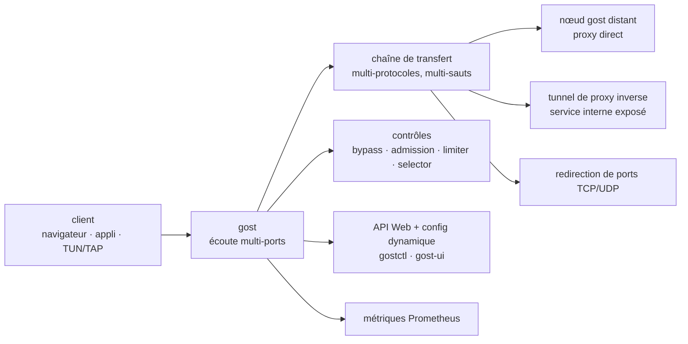

# go-gost/gost

> **Un binaire Go unique qui fait proxy, redirection de ports et tunnel inverse, en chaînant les protocoles.**

## Le problème

Exposer un service d'un réseau privé, traverser un pare-feu ou relayer du trafic par plusieurs
sauts oblige d'ordinaire à empiler des outils différents : un proxy SOCKS ici, un `ssh -R`
là, un reverse proxy HTTP ailleurs, chacun avec sa configuration, ses protocoles et ses règles
d'accès. Rien ne se compose, et le contrôle de ce qui passe (routage, quotas, autorisations)
est à réinventer à chaque étage.

## Ce que ça fait vraiment

GOST — *GO Simple Tunnel* — est un binaire unique qui tient les trois rôles annoncés par le
README : **proxy direct** (servir de proxy d'accès au réseau), **redirection de ports**
(mapper le port d'un service sur celui d'un autre) et **proxy inverse** (exposer sur Internet
un service interne via un tunnel). Dans les trois cas, le point commun revendiqué est la
*chaîne de transfert multi-niveaux* : on compose plusieurs protocoles successifs pour former
le trajet.

La liste de fonctions du README est une liste de cases cochées, chacune pointant vers le site
de documentation `gost.run` : écoute multi-ports, multi-protocoles, redirection TCP/UDP,
proxy transparent TCP/UDP, résolution et proxy DNS, périphériques TUN/TAP et TUN2SOCKS,
répartition de charge, contrôle de routage (*bypass*), contrôle d'admission, limitation de
débit, système de plugins, métriques Prometheus, configuration dynamique et API Web. Deux
interfaces sont maintenues à part : `go-gost/gostctl` (GUI) et `go-gost/gost-ui` (WebUI).

Ce que le README ne fait **pas** : il ne donne aucun exemple de configuration ni aucune ligne
de commande d'usage. Tout le détail de fonctionnement est hors dépôt, sur `gost.run`.

## Comment c'est branché



Aucun diagramme tiré du code n'existe pour ce dépôt : ce schéma est reconstruit depuis le seul
README, et reprend les trois schémas d'ensemble qu'il illustre (proxy, forward, reverse proxy)
plus les concepts nommés dans la liste de fonctions.

## Essayer

Le README ne documente que l'installation, jamais l'usage. Les quatre voies qu'il donne :

```bash
# installation de la dernière version
bash <(curl -fsSL https://github.com/go-gost/gost/raw/master/install.sh) --install
```

```bash
# choisir la version à installer
bash <(curl -fsSL https://github.com/go-gost/gost/raw/master/install.sh)
```

```
git clone https://github.com/go-gost/gost.git
cd gost/cmd/gost
go build
```

```
docker run --rm gogost/gost -V
```

Des binaires précompilés sont publiés dans les *releases* du dépôt. Aucune commande de
lancement d'un tunnel n'est donnée dans le README : elle est à chercher sur `gost.run`.

## Coût et pièges

- **Gratuit, licence MIT, aucun service tiers requis** : le logiciel est un binaire autonome,
  il n'y a ni compte à créer ni quota. Le coût réel est celui des machines relais qu'on loue
  pour former la chaîne, hors du dépôt.
- **La documentation est ailleurs.** Le README est une table des matières de liens vers
  `gost.run` : sans ce site, on a le binaire et rien pour le configurer. C'est la raison de
  l'alerte conservée, et une dépendance à une ressource hébergée hors GitHub.
- **README en chinois**, avec un README anglais séparé (`README_en.md`) signalé par un badge.
  Les vidéos, le groupe Telegram et le groupe Google renvoient au même écosystème.
- **Le script d'installation se lance via `curl | bash`** sur une URL brute du dépôt : à lire
  avant exécution si la machine compte.
- **Deux générations coexistent** : le README pointe un « ancien accès » `v2.gost.run`. Les
  configurations et la documentation de la v2 ne valent pas pour celle-ci.
- **Fonctions à effet de bord système** : TUN/TAP, proxy transparent et redirection touchent
  au réseau de l'hôte, donc demandent des privilèges et peuvent casser la connectivité de la
  machine — non détaillé dans le README.

## Ce que ce n'est pas

- **Ce n'est pas un VPN clé en main.** Il y a des briques (TUN/TAP, TUN2SOCKS, tunnels), pas
  de produit avec client, gestion d'identités et profils prêts à distribuer.
- **Ce n'est pas un serveur web ni un reverse proxy applicatif** : le README ne mentionne ni
  certificats automatiques, ni routage par hôte ou par chemin, ni service de fichiers. Le
  « proxy inverse » ici désigne l'exposition d'un service interne par tunnel, pas la
  terminaison HTTP.
- **Ce n'est pas un outil d'inspection de trafic** : les métriques Prometheus comptent, elles
  ne déchiffrent ni ne rejouent les requêtes.
- **Ce n'est pas auto-documenté** : installer le binaire ne suffit pas à savoir s'en servir,
  et le dépôt seul ne le dit pas.
- **Ce n'est pas neutre juridiquement selon l'usage** : contourner un filtrage réseau relève
  de la politique de l'organisation ou du pays, sujet que le README n'aborde pas.

## Alternatives

| | Quand le préférer |
|---|---|
| **ginuerzh/gost** | La génération précédente du même outil, dont le README signale l'accès `v2.gost.run`. À préférer seulement pour maintenir une installation v2 existante, dont la configuration n'est pas transposable. |
| **ehang-io/nps** | Voisin du catalogue, également serveur de traversée de réseau interne avec console d'administration. À préférer si l'on veut une interface d'administration intégrée comme point d'entrée principal plutôt qu'un binaire piloté par configuration et API. |
| **caddyserver/caddy** | Voisin du catalogue, reverse proxy HTTP avec HTTPS automatique. À préférer dès que le besoin est de publier un site ou une API sur le web ; GOST à préférer quand le besoin est de transporter du TCP/UDP à travers des réseaux. |

`mitmproxy/mitmproxy`, également proposé comme voisin, n'est pas comparable : c'est un proxy
d'interception destiné à lire et modifier du trafic HTTP à des fins de débogage, pas à établir
des tunnels.

## Pour toi

Ce n'est pas un outil de data ou de MLOps, mais il résout un problème qui revient dans ces
métiers : atteindre un service qui n'est pas exposé — un serveur d'inférence sur une machine
GPU derrière un pare-feu, un tableau de bord sur un réseau de laboratoire, un port de
notebook. À garder en réserve pour ce cas précis, sachant que tout l'apprentissage se fait
sur `gost.run` et pas dans le dépôt. À ne pas retenir pour publier une API ou un site :
un reverse proxy HTTP fera mieux et se documentera tout seul.
