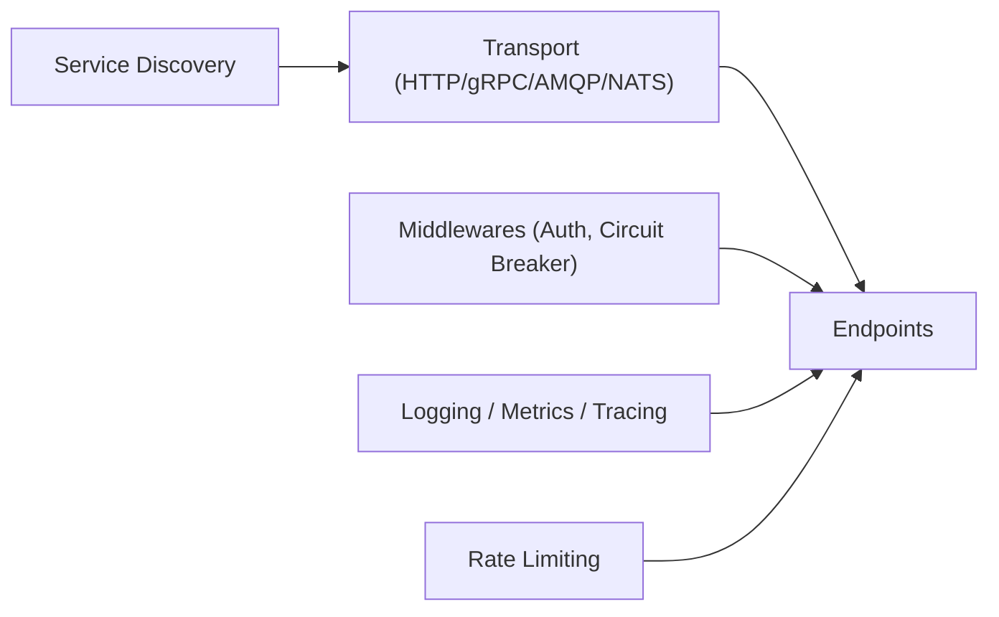

# go-kit/kit

> Boîte à outils Go pour bâtir des microservices : transports, observabilité, découverte de services.

## Le problème
Go fournit des primitives mais peu de briques cohérentes pour des systèmes distribués en entreprise : tracing, métriques, circuit breaker, découverte.

## Ce que ça fait vraiment
Ensemble de paquets autour d'un modèle d'endpoints, avec des middlewares (auth basic, casbin, jwt, circuit breaker, limitation de débit) et des adaptateurs pour la journalisation, les métriques, le traçage, plusieurs transports (HTTP, gRPC, AMQP, NATS, Lambda) et la découverte (Consul, etcd, Eureka, DNS). Le RPC est le seul modèle de messagerie visé. Il ne dicte aucun outil d'exploitation.

## Comment c'est branché

## Essayer
Aucune commande d'installation dans le README ; il renvoie au site gokit.io et précise que Go kit est en version majeure 0 et compatible modules Go.

## Coût et pièges
Gratuit. Dernier push le 2024-07-19, soit plus d'un an. Version majeure 0 : pas de garantie de stabilité d'API. Les générateurs de code listés sont tiers, dont un non maintenu.

## Ce que ce n'est pas
Ce n'est pas un framework à convention : c'est un ensemble de briques à composer. Il ne couvre pas pub/sub ni CQRS (hors objectifs déclarés).

## Alternatives
- gizmo (New York Times) : boîte à outils microservices, citée comme influence.
- go-micro : framework de systèmes distribués.
- Kite : framework de micro-services.

## Pour toi
Ignorer : orienté services Go ; ton besoin de serving ML se règle plus simplement autrement, et le dépôt n'a plus de poussée depuis plus d'un an.

