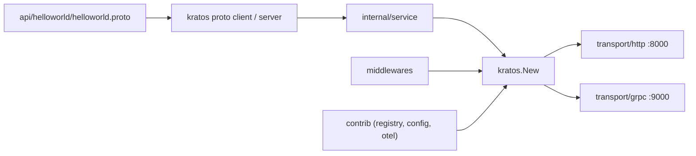

# go-kratos/kratos

> Framework Go léger pour microservices cloud-native, orienté API-first.

## Le problème
Un service Go part toujours du même échafaudage : transport, middleware, configuration, logs, registre.
Maintenir HTTP et gRPC côte à côte double le code de transport.

## Ce que ça fait vraiment
Développement API-first : les Protobuf génèrent le code HTTP et gRPC, avec OpenAPI et erreurs cohérentes.
Couche de transport unifiée : un même service expose `http.NewServer` et `grpc.NewServer` dans une seule application.
Middlewares composables pour récupération, logs, validation, traçage, métriques, authentification.
Journalisation basée sur `log/slog` de la bibliothèque standard, extensions OpenTelemetry dans les paquets contrib.

## Comment c'est branché


## Essayer
```shell
go install github.com/go-kratos/kratos/cmd/kratos/v3@latest
kratos upgrade
kratos new helloworld
cd helloworld
go mod tidy
kratos run
make test
make lint
```

## Coût et pièges
Go 1.25 ou plus, plus `protoc` et `protoc-gen-go` installés : la génération de code est un prérequis, pas une option.
Kratos v3 rend explicites des comportements implicites de v2 : lire le guide de migration avant de toucher à un service en production.

## Ce que ce n'est pas
Ce n'est pas un framework complet à la Spring : le cœur est réduit, les intégrations vivent dans contrib.
Ce n'est pas un runtime : pas de sidecar, pas d'exécution durable, seulement une bibliothèque.
Le README ne mentionne ni licence ni gouvernance.

## Alternatives
go-kit/kit, go-micro, google/go-cloud, go-zero, beego : cités comme influences, donc comme comparables directs.

## Pour toi
Sans intérêt pour un profil data/IA : à ignorer sauf si tu écris des services Go.
