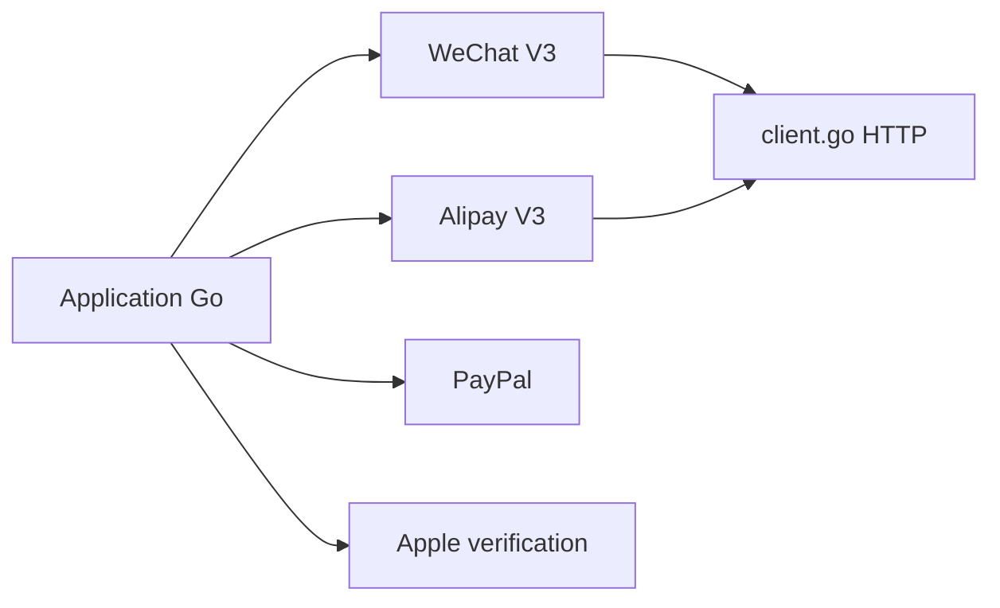

# go-pay/gopay

> SDK Go unifié pour intégrer les paiements WeChat, Alipay, Douyin, QQ, PayPal, Apple et d'autres.

## Le problème
Chaque plateforme de paiement chinoise a sa propre API, ses signatures et ses versions ; les intégrer une à une coûte cher.

## Ce que ça fait vraiment
Fournit un client Go par fournisseur : Alipay (classique et V3), WeChat Pay (V2 et V3), Douyin, QQ, CMB, Allinpay, Lakala, Saobei, PayPal et la vérification de reçus Apple. Un client HTTP partagé (`pkg/xhttp`) sert tous. Depuis la v1.5.119 la vérification des certificats TLS est active par défaut ; le README explique comment la désactiver en bac à sable. Documentation en chinois.

## Comment c'est branché


## Essayer
```bash
go get github.com/go-pay/gopay
```

## Coût et pièges
Gratuit, mais chaque fournisseur exige un compte marchand. Le README recommande de tester en production avec un centime. Ne pas désactiver la vérification TLS ailleurs qu'en bac à sable.

## Ce que ce n'est pas
Pas une passerelle de paiement : c'est un SDK client. README entièrement en chinois, issues traitées par le mainteneur seul.

## Alternatives
Aucune alternative nommée dans le README.

## Pour toi
Ignorer : SDK de paiement en Go pour le marché chinois, hors de ton périmètre data/IA.

