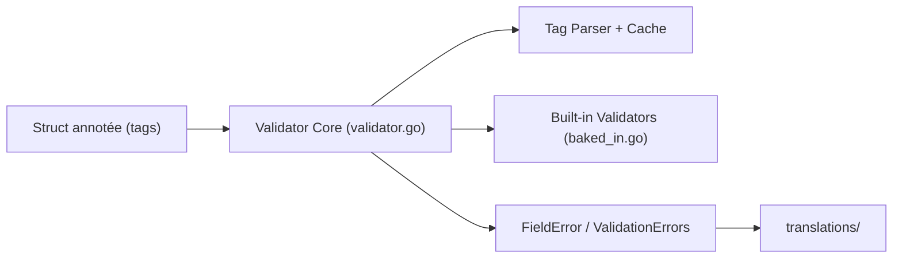

# go-playground/validator

> Bibliothèque Go qui valide structs et champs à partir de tags, pour qui écrit des API en Go.

## Le problème
Vérifier à la main chaque champ d'une requête entrante (format, longueur, cohérence entre champs) produit du code répétitif et fragile.

## Ce que ça fait vraiment
On annote les champs de structs avec des tags (`required`, `email`, `min`, `oneof`…) et `validate.Struct()` renvoie les erreurs. Le README liste des centaines de validations intégrées : réseau, chaînes, formats (UUID, JWT, ISBN, cron, semver), comparaisons, champs croisés, et alias. Il gère aussi l'exploration de tableaux et maps (`dive`), les types personnalisés, des messages d'erreur traduits et sert de validateur par défaut à gin.

## Comment c'est branché


## Essayer
```bash
go get github.com/go-playground/validator/v10
```
Puis `validator.New(validator.WithRequiredStructEnabled())` en Go, recommandé pour les nouveaux usages.

## Coût et pièges
Gratuit, MIT. Le README lance un appel à mainteneurs. L'option `WithRequiredStructEnabled` deviendra le comportement par défaut en v11 ; le support suit la politique de versions de Go.

## Ce que ce n'est pas
Pas un schéma de données ni un validateur de jeux de données : il valide des structures Go en mémoire. Il ne traite pas de DataFrames.

## Alternatives
Aucune alternative citée dans le README.

## Pour toi
Ignorer, sauf si ton service d'inférence est écrit en Go : hors de cet usage, aucun apport pour un profil data / IA.

