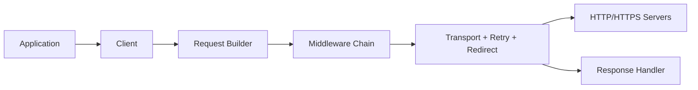

# go-resty/resty

> Client HTTP et REST pour Go, destiné aux développeurs qui appellent des API.

## Le problème
Le client HTTP standard de Go demande beaucoup de code répétitif pour requêtes, réessais et authentification.

## Ce que ça fait vraiment
Le README est réduit : documentation sur resty.dev, Go 1.23 minimum, versions v1 à v3 (`resty.dev/v3`). D'après l'architecture décrite : client, requête, réponse, chaîne de middlewares, transport, réessais, redirections, authentification, débogage/trace.

## Comment c'est branché

## Essayer
Aucune commande dans le README ; renvoi à resty.dev et godoc.

## Coût et pièges
Gratuit. Trois versions majeures coexistent, avec des chemins d'import différents. README court, fiche à faible matière.

## Ce que ce n'est pas
Pas un framework de serveur : uniquement un client. Créateur unique cité : Jeevanandam M.

## Alternatives
Aucune alternative nommée dans le README.

## Pour toi
Surveiller : pratique si tu écris des clients d'API en Go, sans intérêt direct pour un profil Python.

