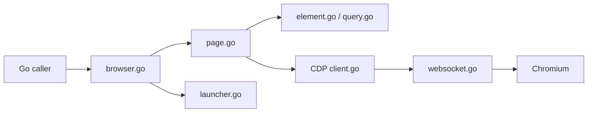

# go-rod/rod

> Pilote Go de Chrome via DevTools Protocol, pour automatisation web et scraping.

## Le problème
Automatiser un navigateur en Go avec les attentes, iframes, shadow DOM et processus zombies est fastidieux et fragile.

## Ce que ça fait vraiment
API haut niveau (`Browser`, `Page`, `Element`) et couches bas niveau (`lib/cdp`, `lib/proto`) réutilisables.
Contexte chaîné pour timeouts/annulation, attente automatique des éléments, interception réseau (`hijack.go`).
Téléchargement automatique du navigateur via `lib/launcher`, pas de processus zombie après crash.
Couverture de tests à 100 % imposée en CI.

## Comment c'est branché

## Essayer
Aucune commande d'installation documentée dans le README : il renvoie à `examples_test.go` et au dossier examples.

## Coût et pièges
Gratuit, MIT. Nécessite un navigateur Chromium (téléchargé automatiquement).
Documentation surtout par les tests et les issues : courbe d'entrée.

## Ce que ce n'est pas
Pas un outil Python ou Node : réservé à Go.
Pas un service de scraping clé en main (proxys, anti-bot non documentés).

## Alternatives
- Chromedp : autre pilote CDP en Go, comparé dans la doc de Rod.

## Pour toi
À surveiller : solide si tu fais du scraping en Go, mais ton écosystème data est probablement Python (Playwright), donc peu prioritaire.
