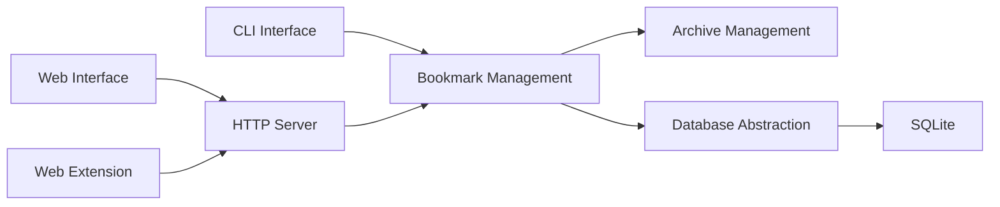

# go-shiori/shiori

> Gestionnaire de favoris auto-hébergé en Go, clone simple de Pocket, en CLI ou web.

## Le problème
Les services de favoris « lire plus tard » ferment ou gardent tes données ; il faut une alternative locale et portable.

## Ce que ça fait vraiment
Ajout, édition, suppression et recherche de favoris en ligne de commande ou via une interface web.
Import/export au format Netscape, import depuis Pocket.
Archive hors ligne du contenu lisible des pages par défaut.
Binaire unique, bases SQLite, PostgreSQL, MariaDB ou MySQL ; extension navigateur en bêta.

## Comment c'est branché

## Essayer
Aucune commande dans le README : il renvoie au dossier docs.

## Coût et pièges
Gratuit, MIT ; rien d'autre de documenté dans le README.

## Ce que ce n'est pas
Pas un lecteur RSS ni un outil de veille collaboratif.
L'extension navigateur est en bêta.

## Alternatives
Aucune alternative nommée dans le README (Pocket est l'outil imité, pas une alternative).

## Pour toi
À ignorer : sans rapport avec la data ou l'IA, sauf à vouloir archiver localement des articles de veille.
