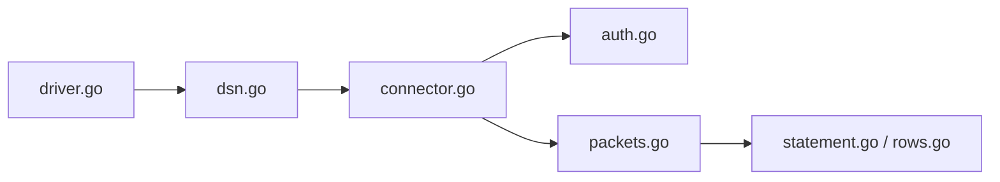

# go-sql-driver/mysql

> Pilote MySQL/MariaDB en pur Go pour le paquet `database/sql`, pour les développeurs Go.

## Le problème
Un programme Go a besoin de parler à MySQL via l'interface standard `database/sql`, sans bindings C.

## Ce que ça fait vraiment
Implémente `database/sql/driver` : DSN, authentification, protocole de paquets, requêtes préparées, lignes de résultats, transactions. Options : compression zlib, parsing de `time.Time`, interpolation de paramètres, `LOAD DATA LOCAL INFILE` avec liste d'autorisation. Supporte MySQL 8.0+ et MariaDB 10.11+ ; TiDB par PingCAP.

## Comment c'est branché


## Essayer
```bash
go get -u github.com/go-sql-driver/mysql
```
```go
db, err := sql.Open("mysql", "user:password@/dbname")
db.SetConnMaxLifetime(time.Minute * 3)
db.SetMaxOpenConns(10)
db.SetMaxIdleConns(10)
```

## Coût et pièges
Gratuit. Go 1.25 minimum. Régler `SetConnMaxLifetime` (sous 5 minutes), sinon des connexions sont coupées côté serveur. `allowAllFiles`, `tls=skip-verify` et `allowCleartextPasswords` sont signalés peu sûrs.

## Ce que ce n'est pas
Pas un ORM. Percona, CloudSQL et Sphinx fonctionnent mais ne sont pas supportés par les mainteneurs. Pas complet selon le README.

## Alternatives
Aucune alternative nommée dans le README.

## Pour toi
À adopter si tu écris du Go qui lit MySQL (pipelines, exporters) : standard de fait, MPL-2.0 (copyleft de fichier, sans gêne en usage normal).

