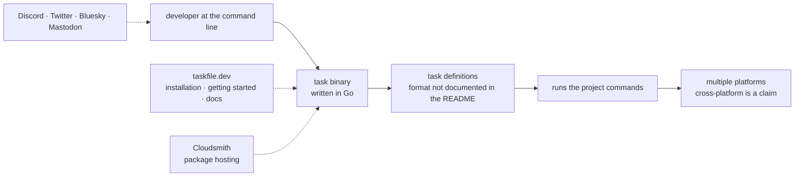

# go-task/task

> **A command-line task runner, an alternative to Make, for anyone automating project commands.**

## The problem

Automating a project's repetitive commands — build, test, release — has traditionally meant a
`Makefile`, whose syntax and behaviour depend on which `make` variant is installed and which
generally assume a Unix-like environment. This repository's README positions itself exactly
there: a tool "inspired by Make" and "cross-platform". It never spells out the symptoms it
claims to fix, so the actual problem has to be inferred from that positioning line alone.

## What it actually does

This is the weak point of the repository as far as a synthesis sheet is concerned: **the
README documents nothing**. It consists of a logo, a title ("Task: The Modern Task Runner"),
one positioning sentence, a row of links, and two sponsor tables. No description of how it
works, no example task file, no flags, no commands.

The only verifiable claim is the positioning sentence: a cross-platform build tool inspired by
Make. It is written with exactly the promotional adjectives this kind of sheet avoids on
principle ("fast", "modern") — which is itself a signal: the tool cannot be described from its
own README without repeating its marketing.

Everything else — task file format, variables, task dependencies, change detection — is pushed
to the `taskfile.dev` site (Installation, Getting Started, Docs pages), outside the repository
and outside this sheet. Catalogue metadata supplies what the README omits: written in Go, MIT
licence, roughly 16,000 stars.

## How it is wired

No code-derived diagram exists for this repository, and the README describes no architecture.
The diagram below therefore only shows the pieces the README names or directly implies: a
binary, external documentation, and sponsor funding.

## Trying it

**The README contains no command at all**, neither install nor usage: it links to
`https://taskfile.dev/docs/installation` and `https://taskfile.dev/docs/getting-started`.
Nothing is reconstructed here — a plausible-looking `go install` or `brew install` line would
be an invention. You have to open both pages to get the first usable command.

## Cost and traps

- **Free**, MIT licence declared: no API key, no account to create, no quota.
- The real cost is documentary: **everything is learned outside the repository**, on a
  third-party site. A README without a single example forces a web round trip before the first
  useful line, and makes any offline evaluation impossible.
- Package hosting is provided by **Cloudsmith**, a third-party service named in the README, so
  the install chain depends on an external provider.
- The project displays **Gold and community sponsors** (devowl.io, GoodX, Magic, Cloudsmith,
  JetBrains). Nothing suggests paid features, but the model rests on outside funding.
- No information on supported versions, backward compatibility of the file format, or breaking
  change policy: the README says nothing about any of it.

## What it is not

- **Not a full build system** in the Bazel or compiler sense: the README presents it as a task
  runner inspired by Make, i.e. a layer that calls commands rather than replacing them.
- **Not a scheduler or a CI pipeline engine**: nothing in the README mentions remote execution,
  scheduling, run tracking, or artifacts.
- **Not a repository that documents itself**: the value lives entirely on `taskfile.dev`.
  Believing the tool can be judged from its GitHub page is the main misunderstanding.

## Alternatives

The README names **no competing repository**; it cites Make as inspiration, but Make is not a
catalogue repository. The supplied neighbours — `harness/harness`, `kubescape/kubescape`,
`infobyte/faraday`, `j3ssie/osmedeus` — cover CI/CD platforms, Kubernetes security, penetration
test management and offensive reconnaissance respectively: none is a local task runner.
`harness/harness` is the only neighbour touching pipeline automation, but it is a server
platform, not a workstation binary — comparing them would be forcing the match. **No comparable
alternative in the catalogue.**

## For you

For a data / AI / MLOps profile, this is the kind of tool that replaces the `Makefile` sitting
at the root of a training or pipeline project: genuine interest, low entry cost, MIT licence.
But the verdict stays **watch** rather than adopt, because nothing in this repository lets you
verify anything: you have to leave for `taskfile.dev` before deciding. Worth revisiting once
the documentation has been read, not on the strength of this GitHub page.
