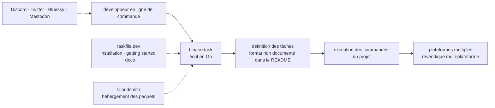

# go-task/task

> **Lanceur de tâches en ligne de commande, alternative à Make, pour qui automatise des commandes de projet.**

## Le problème

Automatiser les commandes répétitives d'un projet — compiler, tester, publier — passe
traditionnellement par un `Makefile`, dont la syntaxe et le comportement dépendent de la
variante de `make` installée et supposent un environnement de type Unix. Le README de ce
dépôt se présente précisément comme une réponse à ce point : un outil « inspiré de Make »
et « multi-plateforme ». Il ne détaille aucun des symptômes qu'il prétend corriger : le
problème exact reste, ici, à déduire du positionnement affiché.

## Ce que ça fait vraiment

C'est le point faible de ce dépôt du point de vue de la fiche : **le README ne documente
rien**. Il tient en un logo, un titre (« Task: The Modern Task Runner »), une phrase de
positionnement, une barre de liens et deux tableaux de sponsors. Aucune description de
fonctionnement, aucun exemple de fichier de tâches, aucune option, aucune commande.

La seule affirmation vérifiable est la phrase de positionnement : outil de construction
multi-plateforme inspiré de Make. Elle est écrite avec les adjectifs promotionnels que ce
genre de fiche évite par principe (« fast », « modern ») — c'est en soi un signal : on ne
peut pas décrire l'outil depuis son README sans reprendre son marketing.

Tout le reste — format du fichier de tâches, variables, dépendances entre tâches, détection
des fichiers modifiés — est renvoyé au site `taskfile.dev` (pages Installation, Getting
Started, Docs), hors du dépôt et hors de cette fiche. Les métadonnées du catalogue ajoutent
ce que le README tait : projet en Go, licence MIT, environ 16 000 étoiles.

## Comment c'est branché

Aucun diagramme tiré du code n'existe pour ce dépôt, et le README ne décrit aucune
architecture. Le schéma ci-dessous ne reprend donc que les pièces que le README nomme ou
implique directement : un binaire, une documentation externe, un financement par sponsors.

## Essayer

**Le README ne contient aucune commande**, ni d'installation, ni d'usage : il renvoie à
`https://taskfile.dev/docs/installation` et `https://taskfile.dev/docs/getting-started`.
Rien n'est reconstruit ici — une ligne `go install` ou `brew install` plausible serait une
invention. Il faut ouvrir les deux pages du site pour obtenir la première commande.

## Coût et pièges

- **Gratuit**, licence MIT déclarée : pas de clé d'API, pas de compte à créer, pas de quota.
- Le vrai coût est documentaire : **tout s'apprend hors du dépôt**, sur un site tiers. Un
  README qui ne montre pas un seul exemple oblige à un aller-retour web avant la première
  ligne utile, et rend impossible toute évaluation hors ligne.
- L'hébergement des paquets est assuré par **Cloudsmith**, un service tiers cité dans le
  README : la chaîne d'installation dépend donc d'un fournisseur externe.
- Le projet affiche des **sponsors « Gold » et communautaires** (devowl.io, GoodX, Magic,
  Cloudsmith, JetBrains). Rien n'indique de fonction payante, mais le modèle repose sur du
  financement externe.
- Aucune information sur les versions supportées, la compatibilité ascendante du format de
  fichier ou la politique de rupture : le README n'en dit rien.

## Ce que ce n'est pas

- **Ce n'est pas un système de build complet** au sens de Bazel ou d'un compilateur : le
  README le présente comme un lanceur de tâches inspiré de Make, donc une couche qui appelle
  des commandes, pas qui les remplace.
- **Ce n'est pas un ordonnanceur ni un moteur de pipeline CI** : rien dans le README ne parle
  d'exécution distante, de planification, de suivi d'exécution ou d'artefacts.
- **Ce n'est pas un dépôt qui se documente lui-même** : la valeur est entièrement sur
  `taskfile.dev`. Croire qu'on peut juger l'outil en lisant sa page GitHub est le malentendu
  principal.

## Alternatives

Le README ne nomme **aucun dépôt concurrent** ; il cite Make comme inspiration, mais Make
n'est pas un dépôt du catalogue. Les voisins fournis — `harness/harness`, `kubescape/kubescape`,
`infobyte/faraday`, `j3ssie/osmedeus` — relèvent respectivement de la plateforme CI/CD, de la
sécurité Kubernetes, de la gestion de tests d'intrusion et de la reconnaissance offensive :
aucun n'est un lanceur de tâches local. `harness/harness` est le seul voisin qui touche à
l'automatisation de pipelines, mais c'est une plateforme serveur, pas un binaire de poste de
travail — le comparer reviendrait à forcer le rapprochement. **Aucune alternative comparable
dans le catalogue.**

## Pour toi

Pour un profil data / IA / MLOps, c'est le genre d'outil qui remplace le `Makefile` posé à la
racine d'un projet d'entraînement ou de pipeline : intérêt réel, coût d'entrée faible, licence
MIT. Mais le verdict reste **surveiller** et non adopter, parce que rien dans ce dépôt ne
permet de vérifier quoi que ce soit : il faut sortir sur `taskfile.dev` avant de décider.
À reprendre en main une fois la documentation lue, pas sur la foi de cette page GitHub.
