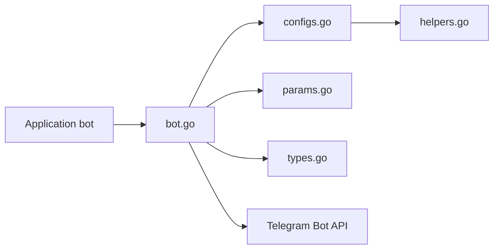

# go-telegram-bot-api/telegram-bot-api

> Bibliothèque Go qui enveloppe l'API Bot de Telegram, pour écrire des bots à la main.

## Le problème
Parler à l'API Telegram par HTTP brut oblige à gérer requêtes, types et mises à jour soi-même.

## Ce que ça fait vraiment
Fournit un client typé : constructeurs de requêtes, types de l'API (dont Passport), encodage des paramètres. Deux modes de réception des messages : long polling (`GetUpdatesChan`) ou webhook (`ListenForWebhook`, avec certificat TLS). Le périmètre est volontairement limité à l'enveloppe de l'API, sans framework de commandes.

## Comment c'est branché


## Essayer
```bash
go get -u github.com/go-telegram-bot-api/telegram-bot-api/v5
```

## Coût et pièges
Gratuit, mais il faut un jeton de bot Telegram. Le webhook exige HTTPS ; le README donne une commande openssl pour un certificat auto-signé. Dernier push en août 2024.

## Ce que ce n'est pas
Pas un framework avec plugins ni gestionnaires de commandes : le README renvoie à d'autres projets sans les nommer.

## Alternatives
Aucune alternative nommée dans le README.

## Pour toi
Surveiller : seulement si tu codes un bot d'alerte ou de notification en Go ; en Python tu n'en as pas l'usage.

