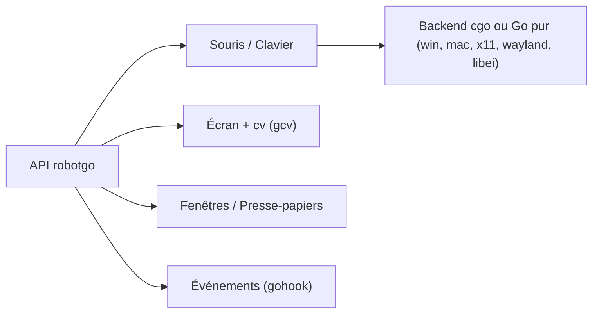

# go-vgo/robotgo

> Bibliothèque Go pour piloter souris, clavier, écran, fenêtres et presse-papiers sur Mac, Windows et Linux.

## Le problème
Automatiser une interface graphique ou tester une application de bureau demande des API différentes selon le système.

## Ce que ça fait vraiment
Une API Go unique (déplacement et clics de souris, frappe clavier, capture d'écran, lecture de pixels, recherche d'image via OpenCV, fenêtres, presse-papiers, écoute d'événements). Elle s'appuie par défaut sur du code C (GCC requis) ; des backends Go purs, expérimentaux, existent pour Windows, macOS, X11, Wayland (wlroots) et libei (GNOME/KDE), choisis par tag de build.

## Comment c'est branché


## Essayer
```bash
go get github.com/go-vgo/robotgo
go build -tags purego .
CGO_ENABLED=0 GOOS=linux GOARCH=amd64 go build -tags x11 .
```

## Coût et pièges
Il faut Go et GCC (MinGW sur Windows) ; sous macOS, autorisations Accessibilité et Enregistrement d'écran. Sous Wayland GNOME/KDE, le backend wlroots ne marche pas ; libei ne gère ni capture ni fenêtres.

## Ce que ce n'est pas
Pas une couche « computer use » clés en main pour agents malgré le slogan : c'est la brique bas niveau. Les versions JavaScript/Python sont réservées à RobotGo-Pro, sans version open source.

## Alternatives
Aucune alternative nommée dans le README.

## Pour toi
À surveiller : utile si tu construis un agent d'usage d'ordinateur en Go, sinon hors sujet ; la moitié des backends sont expérimentaux et l'auteur est unique.

