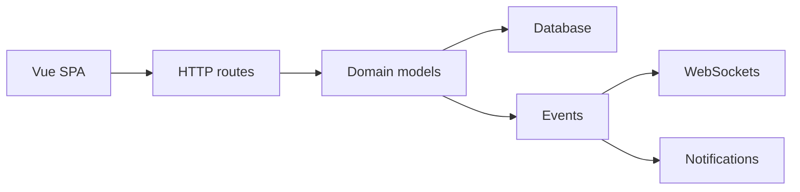

# go-vikunja/vikunja

> Gestionnaire de tâches auto-hébergé, backend Go et interface Vue, pour particuliers et équipes.

## Le problème
Organiser ses tâches sans confier ses données à un service tiers.

## Ce que ça fait vraiment
Serveur Go (API REST, WebSockets, CalDAV) avec interface Vue embarquée dans le binaire. Projets, tâches, étiquettes, rappels, commentaires, pièces jointes, filtres, webhooks. Authentification locale, OpenID/OAuth, LDAP, TOTP. Import depuis Todoist, Trello, Microsoft To Do, TickTick, Wekan, CSV. Stockage local ou S3 ; application de bureau Electron.

## Comment c'est branché

## Essayer
Le README ne donne aucune commande ; il renvoie au site pour l'installation et à try.vikunja.io pour une démo.

## Coût et pièges
Version hébergée et offre Pro payantes (panneau d'admin, journaux d'audit, suivi du temps). Licence AGPL-3.0. Une partie du code est écrite avec des outils de codage assistés par LLM, selon le README.

## Ce que ce n'est pas
Pas un outil data ni IA : c'est une application de gestion de tâches généraliste.

## Alternatives
Le README ne nomme aucune alternative.

## Pour toi
À ignorer pour la veille data/IA : bon produit mais sans rapport avec ton métier ; utile seulement comme outil perso auto-hébergé.
