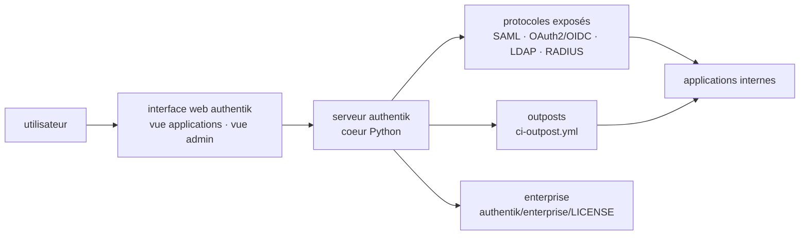

# goauthentik/authentik

> **Self-hosted identity provider centralising SAML, OAuth2/OIDC, LDAP and RADIUS for internal applications.**

## The problem

Without an identity provider, every internal application keeps its own accounts: as many user
stores, password policies and offboarding procedures to maintain separately. And once you want
a single entry point, the protocols disagree — one tool speaks SAML, the next OIDC, the legacy
directory LDAP, the network appliance RADIUS. The usual answer is a hosted commercial IdP, with
per-user billing and identity data held by a third party.

## What it actually does

authentik is an open-source identity provider for SSO, designed to be self-hosted — the README
claims a range from small labs to large production clusters.

It exposes the protocols on the application side: SAML, OAuth2/OIDC, LDAP, RADIUS "and more",
per the README, which does not spell out the full list. The project explicitly positions itself
as a replacement for Okta, Auth0, Entra ID and Ping Identity — that is the framing the README
gives for its enterprise offering.

The repository itself is mostly Python (the language recorded in the catalogue), with a web
interface (`ci-web` build pipeline) and a separately built notion of *outpost* (`ci-outpost`):
the README does not explain it, it only exposes its continuous-integration pipeline. Two
documented screenshots show an end-user "applications" view and an admin view.

Everything that belongs to the external documentation — authentication flows, policies, user
sources — is absent from the README, which consistently points to `docs.goauthentik.io`.

## How it is wired

No code-derived diagram exists for this repository: the schema is reconstructed from the README
alone, and the only file names it offers are those of the CI pipelines (`ci-main.yml`,
`ci-outpost.yml`, `ci-web.yml`) and of the three licence files. The core / web / outpost split
is therefore inferred from those build pipelines, not from reading the code.

## Trying it

The README contains **no commands**: it only lists four installation routes, each deferred to
the online documentation. Nothing is reconstructed here.

- Docker Compose — "recommended for small/test setups", documentation at
  `docs.goauthentik.io/docs/install-config/install/docker-compose/`
- Kubernetes via Helm chart — "recommended for larger setups", chart in the separate
  `goauthentik/helm` repository
- AWS CloudFormation, using official templates
- DigitalOcean Marketplace, one-click deployment

For contributing, the README points to the Developer Documentation for setting up a local build
environment; again, without a single command.

## Cost and traps

- **Three licences in one repository**: MIT for the code, CC BY-SA 4.0 for the website
  (`website/LICENSE`), and a vendor-specific "authentik EE" licence for
  `authentik/enterprise/LICENSE`. The catalogue records `NOASSERTION` — GitHub could not decide.
  Hence the two warnings: the exact MIT perimeter must be checked file by file before any
  internal use.
- **Freemium by design**: a paid enterprise offering exists (`goauthentik.io/pricing`), aimed at
  organisations replacing a commercial IdP. The README does not say what falls on the paid side;
  the separately licensed `authentik/enterprise/` directory is the only clue.
- **Operating cost, not licence cost**: an IdP is a single point of failure. It needs a database,
  high availability, backups and a restore procedure. The README covers none of these
  prerequisites — no RAM, no CPU, no dependencies.
- **Docker or Kubernetes in practice**: all four routes go through a container or a marketplace.
  No source install is documented in the README.
- **Documentation entirely external**: everything operational lives on `docs.goauthentik.io`.
  The repository alone is not enough to deploy.

## What it is not

- **Not an enterprise directory**: authentik speaks LDAP, it does not replace the machine
  management or group policies of an Active Directory.
- **Not a SaaS**: no hosted offering is described in the README; the enterprise offering is a
  licence, and operating it stays on you.
- **Not a reverse proxy or a web application firewall**: it supplies identity, not traffic
  protection. Outposts are mentioned, but their role is not documented here.
- **Not entirely MIT**, contrary to what the first licence badge suggests — see "Cost and traps".

## Alternatives

| | When to prefer it |
|---|---|
| **oauth2-proxy/oauth2-proxy** | The only comparable neighbour. It is an authentication proxy that *delegates* to an existing provider: prefer it when you already have an IdP and just want to put an application behind it. Prefer authentik when the provider itself is what is missing. |

The other catalogue neighbours are not comparable: `drakkan/sftpgo` is a file transfer server,
`bunkerity/bunkerweb` a web application firewall and `kubearmor/KubeArmor` a runtime security
policy engine on Kubernetes — three security tools, no identity provider. The competitors named
in the README (Okta, Auth0, Entra ID, Ping Identity) are commercial products, not repositories.

## For you

The subject is not data or MLOps as such, but it is the missing brick as soon as an internal
platform grows past a single tool: MLflow, a dashboard, a shared notebook service, a model API
— all of them need to know who may come in, and none of them wants to manage accounts. A single
OIDC-speaking IdP in front of all of it settles the question once. Worth adopting in that role,
knowing it is infrastructure to operate rather than a dependency to install, and after settling
the question of what the three licences actually cover.
