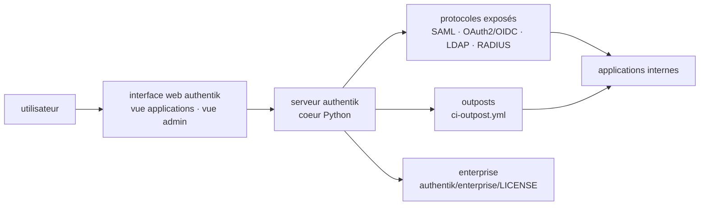

# goauthentik/authentik

> **Fournisseur d'identité auto-hébergé qui centralise SAML, OAuth2/OIDC, LDAP et RADIUS pour toutes les applications internes.**

## Le problème

Sans fournisseur d'identité, chaque application interne gère ses propres comptes : autant de
bases d'utilisateurs, de politiques de mot de passe et de procédures de départ à tenir à jour
séparément. Et quand on veut un point d'entrée unique, les protocoles ne s'accordent pas — un
outil parle SAML, le suivant OIDC, l'ancien annuaire LDAP, l'équipement réseau RADIUS. La voie
courante est un IdP commercial hébergé, avec facturation par utilisateur et données d'identité
chez un tiers.

## Ce que ça fait vraiment

authentik est un fournisseur d'identité open source pour du SSO, conçu pour être auto-hébergé
— le README revendique l'échelle du petit laboratoire jusqu'au cluster de production.

Il expose les protocoles côté application : SAML, OAuth2/OIDC, LDAP, RADIUS, « et plus »,
selon le README, qui ne détaille pas la liste complète. Le projet se positionne explicitement
comme remplaçant d'Okta, Auth0, Entra ID et Ping Identity — c'est le cadrage donné par le
README pour l'offre entreprise.

Le dépôt lui-même est majoritairement Python (langage relevé dans le catalogue), avec une
interface web (chaîne de build `ci-web`) et une notion d'*outpost* construite séparément
(`ci-outpost`) : le README ne l'explique pas, il en expose seulement la chaîne d'intégration
continue. Deux captures d'écran documentées montrent une vue « applications » pour
l'utilisateur et une vue d'administration.

Ce qui relève de la documentation externe — flux d'authentification, politiques, sources
d'utilisateurs — n'est pas décrit dans le README, qui renvoie systématiquement à
`docs.goauthentik.io`.

## Comment c'est branché

Aucun diagramme tiré du code n'existe pour ce dépôt : ce schéma est reconstruit depuis le seul
README, et les seuls noms de fichiers dont il dispose sont ceux des chaînes d'intégration
continue (`ci-main.yml`, `ci-outpost.yml`, `ci-web.yml`) et des trois fichiers de licence. La
séparation cœur / web / outpost est donc déduite de ces chaînes de build, pas d'une lecture du
code.

## Essayer

Le README ne contient **aucune commande** : il ne donne que quatre voies d'installation, chacune
renvoyée à la documentation en ligne. Rien n'est reconstruit ici.

- Docker Compose — « recommended for small/test setups », documentation
  `docs.goauthentik.io/docs/install-config/install/docker-compose/`
- Kubernetes via chart Helm — « recommended for larger setups », chart dans le dépôt séparé
  `goauthentik/helm`
- AWS CloudFormation, via des gabarits officiels
- DigitalOcean Marketplace, déploiement en un clic

Pour contribuer, le README renvoie à la *Developer Documentation* pour monter un environnement
de build local ; là encore, sans commande.

## Coût et pièges

- **Trois licences dans un même dépôt** : MIT pour le code, CC BY-SA 4.0 pour le site
  (`website/LICENSE`), et une licence « authentik EE » propre à l'éditeur pour
  `authentik/enterprise/LICENSE`. Le catalogue relève `NOASSERTION` — GitHub n'a pas su trancher.
  C'est la raison des deux alertes : le périmètre exact du MIT est à vérifier fichier par fichier
  avant tout usage interne.
- **Freemium assumé** : une offre entreprise payante existe (`goauthentik.io/pricing`), destinée
  aux organisations qui remplacent un IdP commercial. Le README ne dit pas ce qui bascule du côté
  payant ; le répertoire `authentik/enterprise/` sous licence séparée est le seul indice.
- **Coût d'exploitation, pas coût de licence** : un IdP est un point de défaillance unique. Il
  demande une base de données, de la haute disponibilité, des sauvegardes et une procédure de
  restauration. Le README n'aborde aucun de ces prérequis — ni RAM, ni CPU, ni dépendances.
- **Docker ou Kubernetes de fait** : les quatre voies proposées passent toutes par un
  conteneur ou une place de marché. Aucune installation depuis les sources n'est documentée dans
  le README.
- **Documentation entièrement externe** : tout ce qui est opérationnel vit sur
  `docs.goauthentik.io`. Le dépôt seul ne suffit pas à déployer.

## Ce que ce n'est pas

- **Ce n'est pas un annuaire d'entreprise** : authentik parle LDAP, il ne remplace pas la
  gestion de postes ni les stratégies de groupe d'un Active Directory.
- **Ce n'est pas un SaaS** : il n'y a pas d'offre hébergée décrite dans le README ; l'offre
  entreprise est une licence, l'exploitation reste à ta charge.
- **Ce n'est pas un reverse proxy ni un pare-feu applicatif** : il fournit l'identité, pas la
  protection du trafic. Les *outposts* sont mentionnés, mais leur rôle n'est pas documenté ici.
- **Ce n'est pas entièrement MIT**, contrairement à ce que le premier badge de licence laisse
  croire — voir « Coût et pièges ».

## Alternatives

| | Quand le préférer |
|---|---|
| **oauth2-proxy/oauth2-proxy** | Le seul voisin comparable. C'est un proxy d'authentification qui *délègue* à un fournisseur existant : à préférer quand on a déjà un IdP et qu'on veut juste protéger une application derrière. authentik à préférer quand c'est le fournisseur lui-même qui manque. |

Les autres voisins du catalogue ne sont pas comparables : `drakkan/sftpgo` est un serveur de
transfert de fichiers, `bunkerity/bunkerweb` un pare-feu applicatif web et
`kubearmor/KubeArmor` un moteur de politiques de sécurité à l'exécution sur Kubernetes — trois
outils de sécurité, aucun fournisseur d'identité. Les concurrents nommés dans le README (Okta,
Auth0, Entra ID, Ping Identity) sont des produits commerciaux, pas des dépôts.

## Pour toi

Le sujet n'est pas data ni MLOps en soi, mais c'est la brique qui manque dès qu'une plateforme
interne dépasse un outil : MLflow, un tableau de bord, un carnet de notes partagé, une API de
modèle — tous demandent qui a le droit d'entrer, et aucun ne veut gérer des comptes. Un IdP
unique parlant OIDC devant tout ça règle la question une fois. À adopter dans ce rôle, en
sachant que c'est une infrastructure à exploiter, pas une dépendance à installer, et en levant
d'abord la question du périmètre des trois licences.
