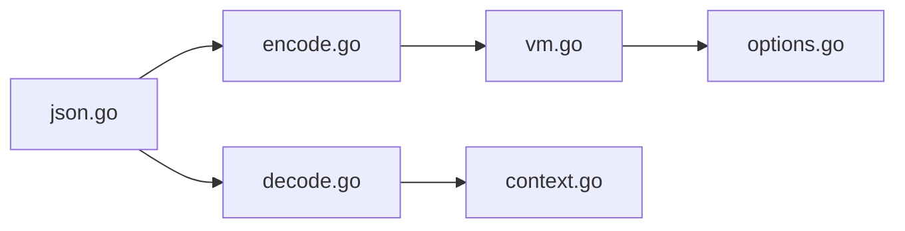

# goccy/go-json

> Encodeur et décodeur JSON Go, compatible avec encoding/json, annoncé plus rapide.

## Le problème
`encoding/json` est lent sur les charges lourdes et les alternatives cassent la compatibilité.

## Ce que ça fait vraiment
Remplacement par simple changement d'import. Techniques décrites : réutilisation de tampons, suppression de la réflexion via `typeptr`, encodage par séquence d'opcodes, bitmaps pour la recherche de champs au décodage. Options : contexte propagé, filtrage typé de champs, sortie colorée. Les chiffres de benchmarks ne sont pas dans le texte lu.

## Comment c'est branché


## Essayer
```
go get github.com/goccy/go-json
```
```
-import "encoding/json"
+import "github.com/goccy/go-json"
```

## Coût et pièges
Gratuit. S'appuie sur `unsafe` ; la variante NoEscape est optionnelle à cause d'un bug du compilateur Go. 173 issues ouvertes.

## Ce que ce n'est pas
Pas garanti identique à encoding/json sur tous les cas limites : tester avant de basculer.

## Alternatives
json-iterator/go, segmentio/encoding/json, easyjson, gojay, simdjson-go (tableau comparatif du README).

## Pour toi
Gain possible sur des services Go à fort volume JSON ; mesurer d'abord : surveiller.

