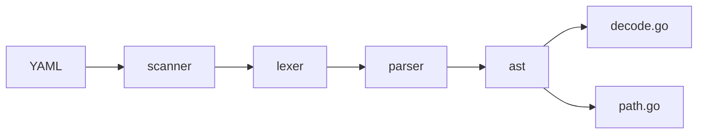

# goccy/go-yaml

> Bibliothèque YAML pour Go écrite de zéro, alternative à go-yaml/yaml.

## Le problème
La bibliothèque de référence go-yaml/yaml est peu maintenue, ne parse pas tout YAML et produit des erreurs peu lisibles.

## Ce que ça fait vraiment
Marshal/Unmarshal par réflexion avec tags `yaml` ou `json`, sans dépendance. Ajoute un tokenizer et un parser exposés, un AST qui préserve commentaires, ancres et alias, des requêtes YAMLPath, des erreurs formatées avec position et couleur, la validation via go-playground/validator et la résolution d'ancres depuis d'autres fichiers. Selon le README, elle passe environ 60 cas de plus que `yaml.v3` de la suite officielle (au 2024-12-15).

## Comment c'est branché


## Essayer
```bash
go get github.com/goccy/go-yaml
git clone https://github.com/goccy/go-yaml.git
cd go-yaml/cmd/ycat && go install .
```

## Coût et pièges
Gratuit. 223 issues ouvertes. Les tests à dépendances externes vont dans `testdata`.

## Ce que ce n'est pas
Pas un fork de go-yaml/yaml : le README insiste qu'il n'y a aucune relation. Les marshalers `Bytes` sont plus lents que les `Interface`.

## Alternatives
Le README cite go-yaml/yaml, ghodss/yaml et sigs.k8s.io/yaml (à éviter selon lui).

## Pour toi
À ignorer sauf projet Go : bonne bibliothèque pour lire des configs YAML, mais purement Go.

