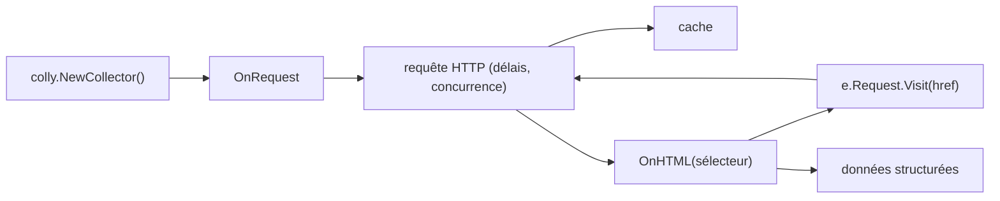

# gocolly/colly

> Framework Go de crawling pour extraire des données structurées de sites web.

## Le problème
Écrire un crawler à la main veut dire gérer soi-même cookies, délais, concurrence et encodages.
Sans limitation par domaine, un scraper naïf se fait bannir en quelques minutes.

## Ce que ça fait vraiment
Un `Collector` déclare des rappels : `OnHTML` sur un sélecteur CSS, `OnRequest` avant chaque requête.
Gère automatiquement cookies et sessions, les délais entre requêtes et la concurrence maximale par domaine.
Modes synchrone, asynchrone et parallèle ; cache des réponses ; encodage automatique des réponses non-unicode.
Support de `robots.txt`, scraping distribué, configuration par variables d'environnement, système d'extensions.

## Comment c'est branché


## Essayer
```bash
go get github.com/gocolly/colly/v2
```

## Coût et pièges
Gratuit côté logiciel ; le README pousse deux services payants (NodeMaven pour les proxies, SerpApi pour la recherche) avec codes promo.
Annoncé à plus de 1 000 requêtes par seconde sur un seul cœur : c'est aussi un bon moyen de se faire bloquer.

## Ce que ce n'est pas
Ce n'est pas un navigateur : pas de JavaScript exécuté, donc rien à tirer d'une page rendue côté client.
Ce n'est pas une protection juridique : respecter `robots.txt` est une option, pas une garantie de conformité.
Le canal de support indiqué (`#colly` sur freenode) n'existe plus sous cette forme.

## Alternatives
Aucune alternative nommée dans le README ; seulement une liste de projets qui l'utilisent.

## Pour toi
L'outil correct si ta collecte de données cible du HTML statique et que tu acceptes d'écrire du Go.
