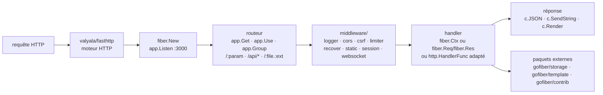

# gofiber/fiber

> **Go web framework with an Express-shaped API, for writing HTTP services without net/http.**

## The problem

Coming from Node.js and wanting to write an HTTP service in Go means relearning `net/http`:
routing by hand or through a third-party router, middleware chaining to assemble yourself,
handler signatures that look like nothing familiar. The README names that step explicitly
("a learning curve") as the reason the project exists. From the other side, someone already
writing Go and chasing throughput runs into the allocation cost of `net/http` on hot paths.

## What it actually does

Fiber is a Go library that puts an Express-style API on top of `fasthttp` (from
`valyala/fasthttp`): `fiber.New()`, `app.Get("/:name", handler)`, `app.Use(...)`,
`app.Group("/api", middleware)`, `c.Params()`, `c.JSON()`, `c.SendString()`,
`app.Listen(":3000")`. The router handles named parameters, wildcards (`/api/*`), compound
segments (`/flights/:from-:to`, `/:file.:ext`), optional parameters (`:gender?`) and named
routes read back with `app.GetRoute("api")`.

The repository ships some thirty internal middlewares, all under `middleware/`: `adaptor`,
`basicauth`, `cache`, `compress` (deflate, gzip, brotli, zstd), `cors`, `csrf`, `earlydata`,
`encryptcookie`, `envvar`, `etag`, `expvar`, `favicon`, `healthcheck`, `helmet`,
`hostauthorization`, `idempotency`, `keyauth`, `limiter`, `logger`, `paginate`, `pprof`,
`proxy`, `recover`, `redirect`, `requestid`, `responsetime`, `rewrite`, `session`, `skip`,
`static`, `timeout`, plus `websocket`. Template rendering defaults to `html/template`, or goes
through the external `gofiber/template` package (nine engines announced).

In v3 the router takes `net/http` handlers directly (`http.HandlerFunc`), native
`fasthttp.RequestHandler` callbacks, and Express-shaped handlers with two or three arguments
over the `fiber.Req` / `fiber.Res` interfaces. The rest — storage drivers, third-party
middleware — lives outside the repository, in `gofiber/storage` and `gofiber/contrib`.

## How it is wired



No code-derived diagram exists for this repository: the graph above is rebuilt from the README
alone. The structural point is the first node — Fiber does not implement the HTTP stack, it
borrows it from `fasthttp`; every property it has, good and bad, follows from that.

## Try it

```bash
go mod init github.com/your/repo
```

```bash
go get -u github.com/gofiber/fiber/v3
```

```go title="Example"
package main

import (
    "log"

    "github.com/gofiber/fiber/v3"
)

func main() {
    // Initialize a new Fiber app
    app := fiber.New()

    // Define a route for the GET method on the root path '/'
    app.Get("/", func(c fiber.Ctx) error {
        // Send a string response to the client
        return c.SendString("Hello, World 👋!")
    })

    // Start the server on port 3000
    log.Fatal(app.Listen(":3000"))
}
```

The README then says to visit `http://localhost:3000`. To check a middleware, it gives, once
`cors.New()` is mounted:

```bash
curl -H "Origin: http://example.com" --verbose http://localhost:3000
```

For contributors the `Makefile` is documented: `make help`, `make audit`, `make benchmark`,
`make coverage`, `make format`, `make lint`, `make test`, `make tidy`.

## Cost and traps

- **Go 1.26 or higher** is required by the README for v3. That is a lower bound stated against
  a very recent release: an older Go environment is out of spec.
- **The context is reused across requests.** The README devotes a section to it: values
  returned from `fiber.Ctx` are not immutable and will be reused. You must keep no reference
  past the handler. This is the trap that produces hard-to-reproduce data corruption, and it is
  the direct price of "zero allocation".
- **Reliance on `unsafe`.** The README states it under limitations: the use of `unsafe` means
  the library may not always be compatible with the latest Go version.
- **Adapting `net/http` costs something.** The README notes that adapted `net/http` handlers
  keep standard-library semantics, get no access to `fiber.Ctx` features, and pay the overhead
  of the compatibility layer.
- **`TrustProxy`**: the README example carries an inline warning — enabling `TrustProxy: true`
  with unrestricted IPs leads to IP spoofing.
- **The project runs on donations.** The README explicitly asks for sponsorship to pay for the
  domain name, GitBook, Netlify and serverless hosting. Nothing to pay to use it, but the
  documentation infrastructure rests on that funding.
- **The scope spills outside the repository**: session storage, template engines, socket.io and
  third-party middleware live in `gofiber/storage`, `gofiber/template` and `gofiber/contrib`,
  each with its own release cycle.

## What it is not

- **It is not `net/http`.** Fiber runs on `fasthttp`, whose request model differs from the
  standard library. The whole Go ecosystem that expects an `http.Handler` does not plug in for
  free: the README documents automatic adaptation for common shapes and an `adaptor` middleware
  for the rest, which implies the problem exists.
- **It is not Express**, despite the stated inspiration: names and principles look alike, the
  memory semantics do not. In Express a value read from the request stays valid; here it gets
  recycled.
- **It is not a contract-first API framework** — no OpenAPI generation and no schema validation
  announced in the README: it is a router plus middleware, and the contract layer is still
  yours to write.
- **It is not an application server**: no ORM, no dependency injection, no imposed project
  layout. The README claims minimalism and "the UNIX way".

## Alternatives

| | When to pick it |
|---|---|
| **valyala/fasthttp** | Named in the README: the HTTP engine Fiber is built on. Pick it if you want the throughput without the convenience layer and want full control over routing. Pick Fiber as soon as you would rather not rewrite a router and middleware set. |
| **expressjs/express** | Named in the README as the inspiration. Pick it if the team already lives in Node and the expected gain does not justify changing language — same API shape, plus the npm ecosystem. |
| **danielgtaylor/huma** (neighbour) | A contract-oriented Go API framework with schema description: pick it when the expected output is a described, validated API rather than a bare router. |

The other catalogue neighbours are not comparable: `fastify/fastify` is a Node web framework
(same family of ideas, different language), `aldinokemal/go-whatsapp-web-multidevice` is an
application service written in Go, and `Azure/azure-sdk-for-go` is a client SDK — neither
performs the job of a web framework.

## For you

Worth watching rather than adopting, unless Go services are already part of the landscape. For
a data / AI / MLOps profile working in Python, the real ground of application is narrow:
serving a model calls for FastAPI and the Python ecosystem, not a rewrite in Go. The case where
Fiber becomes relevant is the façade in front of inference — gateway, rate limiting,
authentication, proxying — when the latency and memory footprint of the Python service become
the limiting factor. There, the `limiter`, `keyauth`, `proxy`, `healthcheck` and `pprof`
middlewares are already present, and the "Zero Allocation" section should be read before the
first line of code.
