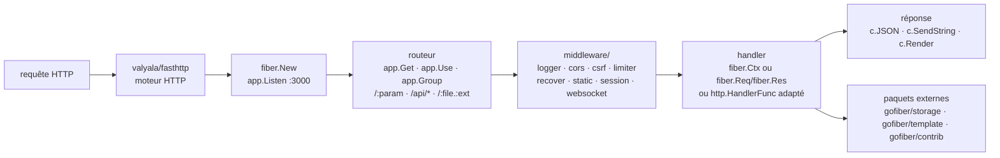

# gofiber/fiber

> **Cadre web Go à l'API calquée sur Express, pour écrire des services HTTP sans passer par net/http.**

## Le problème

Arriver de Node.js et vouloir écrire un service HTTP en Go oblige à réapprendre `net/http` :
routage à la main ou via un routeur tiers, chaînage des middlewares à construire soi-même,
signatures de handlers qui ne ressemblent à rien de connu. Le README nomme explicitement cette
marche à franchir (« a learning curve ») comme la raison d'être du projet. À l'inverse, celui
qui vient déjà de Go et cherche du débit se heurte au coût d'allocation de `net/http` sur les
chemins chauds.

## Ce que ça fait vraiment

Fiber est une bibliothèque Go qui pose une API de type Express par-dessus `fasthttp` (de
`valyala/fasthttp`) : `fiber.New()`, `app.Get("/:name", handler)`, `app.Use(...)`,
`app.Group("/api", middleware)`, `c.Params()`, `c.JSON()`, `c.SendString()`,
`app.Listen(":3000")`. Le routage gère les paramètres nommés, les jokers (`/api/*`), les
segments composés (`/flights/:from-:to`, `/:file.:ext`), les paramètres optionnels
(`:gender?`) et le nommage de routes relu par `app.GetRoute("api")`.

Le dépôt embarque une trentaine de middlewares internes, tous sous `middleware/` : `adaptor`,
`basicauth`, `cache`, `compress` (deflate, gzip, brotli, zstd), `cors`, `csrf`, `earlydata`,
`encryptcookie`, `envvar`, `etag`, `expvar`, `favicon`, `healthcheck`, `helmet`,
`hostauthorization`, `idempotency`, `keyauth`, `limiter`, `logger`, `paginate`, `pprof`,
`proxy`, `recover`, `redirect`, `requestid`, `responsetime`, `rewrite`, `session`, `skip`,
`static`, `timeout`, plus `websocket`. Le rendu de gabarits passe par `html/template` par
défaut, ou par le paquet externe `gofiber/template` (neuf moteurs annoncés).

En v3, le routeur accepte directement des handlers `net/http` (`http.HandlerFunc`), des
callbacks `fasthttp.RequestHandler`, et des handlers de forme Express à deux ou trois arguments
sur les interfaces `fiber.Req` / `fiber.Res`. Le reste — pilotes de stockage, middlewares
tiers — est hors dépôt, dans `gofiber/storage` et `gofiber/contrib`.

## Comment c'est branché



Aucun diagramme tiré du code n'existe pour ce dépôt : ce schéma est reconstruit depuis le seul
README. Le point structurant est le premier nœud — Fiber n'implémente pas la pile HTTP, il
l'emprunte à `fasthttp` ; toutes ses propriétés, bonnes comme mauvaises, en découlent.

## Essayer

```bash
go mod init github.com/your/repo
```

```bash
go get -u github.com/gofiber/fiber/v3
```

```go title="Example"
package main

import (
    "log"

    "github.com/gofiber/fiber/v3"
)

func main() {
    // Initialize a new Fiber app
    app := fiber.New()

    // Define a route for the GET method on the root path '/'
    app.Get("/", func(c fiber.Ctx) error {
        // Send a string response to the client
        return c.SendString("Hello, World 👋!")
    })

    // Start the server on port 3000
    log.Fatal(app.Listen(":3000"))
}
```

Le README précise qu'on visite ensuite `http://localhost:3000`. Pour vérifier un middleware,
il donne par exemple, une fois `cors.New()` monté :

```bash
curl -H "Origin: http://example.com" --verbose http://localhost:3000
```

Côté contribution, le `Makefile` est documenté : `make help`, `make audit`, `make benchmark`,
`make coverage`, `make format`, `make lint`, `make test`, `make tidy`.

## Coût et pièges

- **Go 1.26 ou plus récent** est exigé par le README pour la v3. C'est une borne haute, pas
  basse : un environnement Go plus ancien est hors spécification.
- **Le contexte est réutilisé entre requêtes.** Le README y consacre une section : les valeurs
  renvoyées par `fiber.Ctx` ne sont pas immuables et seront réutilisées. On ne doit garder
  aucune référence au-delà du handler. C'est le piège qui produit des bugs de corruption de
  données difficiles à reproduire, et c'est le prix direct du « zero allocation ».
- **Dépendance à `unsafe`.** Le README l'écrit dans ses limitations : l'usage d'`unsafe` fait
  que la bibliothèque peut ne pas être compatible avec la dernière version de Go.
- **L'adaptation `net/http` a un coût.** Le README note que les handlers `net/http` adaptés
  gardent la sémantique de la bibliothèque standard, n'ont pas accès aux fonctions de
  `fiber.Ctx` et paient la couche de compatibilité.
- **`TrustProxy`** : l'exemple du README porte un avertissement en commentaire — activer
  `TrustProxy: true` sans restreindre les IP ouvre à l'usurpation d'adresse.
- **Le projet vit de dons.** Le README demande explicitement des parrainages pour payer nom de
  domaine, GitBook, Netlify et hébergement serverless. Rien à payer pour l'utiliser, mais
  l'infrastructure de documentation repose sur ce financement.
- **Le périmètre déborde le dépôt** : stockage de sessions, moteurs de gabarits, socket.io,
  middlewares tiers vivent dans `gofiber/storage`, `gofiber/template`, `gofiber/contrib`, avec
  leurs propres cycles de version.

## Ce que ce n'est pas

- **Ce n'est pas du `net/http`.** Fiber tourne sur `fasthttp`, dont le modèle de requête
  diffère de la bibliothèque standard. Tout l'écosystème Go qui attend un `http.Handler` ne se
  branche pas gratuitement : le README documente une adaptation automatique pour les formes
  courantes et un middleware `adaptor` pour le reste, ce qui suppose que le problème existe.
- **Ce n'est pas Express**, malgré l'inspiration revendiquée : les noms et principes se
  ressemblent, la sémantique mémoire non. En Express, une valeur lue dans la requête reste
  valide ; ici elle est recyclée.
- **Ce n'est pas un cadre d'API à contrat**, pas de génération d'OpenAPI ni de validation de
  schéma annoncée dans le README : c'est un routeur plus des middlewares, la couche contrat
  reste à écrire.
- **Ce n'est pas un serveur d'applications** : pas d'ORM, pas d'injection de dépendances, pas
  de structure de projet imposée. Le README revendique le minimalisme et « la voie UNIX ».

## Alternatives

| | Quand le préférer |
|---|---|
| **valyala/fasthttp** | Nommé dans le README : c'est le moteur HTTP sur lequel Fiber est construit. À préférer si l'on veut le débit sans la couche de confort, et garder la maîtrise complète du routage. Fiber à préférer dès qu'on ne veut pas réécrire routeur et middlewares. |
| **expressjs/express** | Nommé dans le README comme la source d'inspiration. À préférer si l'équipe est déjà en Node et que le gain attendu ne justifie pas un changement de langage — l'API est la même, l'écosystème npm en plus. |
| **danielgtaylor/huma** (voisin) | Cadre Go d'API orienté contrat, avec description du schéma : à préférer quand la sortie attendue est une API décrite et validée plutôt qu'un routeur brut. |

Les autres voisins du catalogue ne sont pas comparables : `fastify/fastify` est un cadre web
Node (même famille d'idées, autre langage), `aldinokemal/go-whatsapp-web-multidevice` est un
service applicatif écrit en Go et `Azure/azure-sdk-for-go` un SDK client — ni l'un ni l'autre
ne rend le service d'un cadre web.

## Pour toi

À surveiller plutôt qu'à adopter, sauf si des services Go font déjà partie du décor. Pour un
profil data / IA / MLOps travaillant en Python, le terrain d'application réel est étroit :
exposer un modèle appelle FastAPI et l'écosystème Python, pas une réécriture en Go. Le cas où
Fiber devient pertinent est la couche de façade devant l'inférence — passerelle, limitation de
débit, authentification, proxy — quand la latence et l'empreinte mémoire du service Python
deviennent le facteur limitant. Dans ce cas, les middlewares `limiter`, `keyauth`, `proxy`,
`healthcheck` et `pprof` sont déjà là, et la section « Zero Allocation » est à lire avant la
première ligne de code.
