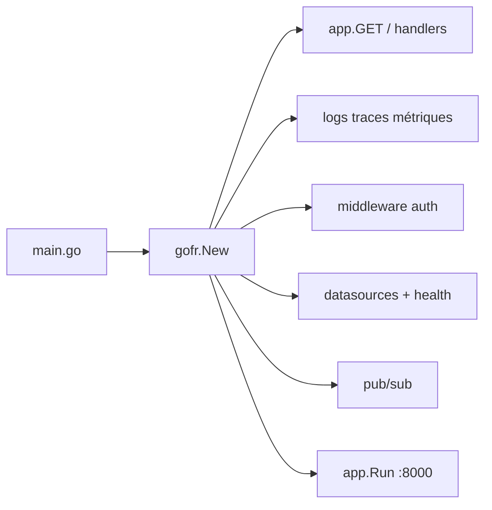

# gofr-dev/gofr

> Framework Go opinionné pour écrire des microservices déployés sur Kubernetes avec observabilité incluse.

## Le problème
Chaque microservice Go recommence les mêmes couches : config, logs, traces, métriques, santé, migrations.
Le code métier finit noyé dans cette plomberie répétée d'un service à l'autre.

## Ce que ça fait vraiment
Fournit une API HTTP courte (`app.GET`, `app.Run()`) qui sert par défaut sur `localhost:8000`.
Embarque logs, traces et métriques, plus des middlewares d'authentification et des middlewares maison.
Couvre gRPC, pub/sub, websockets, cron, migrations de base et rendu Swagger.
Ajoute un health check sur toutes les sources de données et le changement de niveau de log sans redémarrage.

## Comment c'est branché


## Essayer
```bash
go get -u gofr.dev/pkg/gofr
go run main.go
```
Le service répond alors sur `localhost:8000/greet`. Clonage : `git clone https://github.com/gofr-dev/gofr.git`.

## Coût et pièges
Exige Go 1.26 ou plus. Le framework est décrit comme orienté Kubernetes : hors de ce contexte, une partie
des choix (santé, config, observabilité) te sera imposée sans te servir.

## Ce que ce n'est pas
Pas une bibliothèque neutre : le README le présente comme opinionné, tu adoptes ses conventions.
Pas un outil de données : c'est un socle de service web, pas un traitement de flux.
Pas une fondation : le dépôt est listé au CNCF Landscape, ce qui n'est pas une gouvernance CNCF.

## Alternatives
Aucune nommée dans le README.

## Pour toi
Hors sujet pour un profil data/MLOps, sauf si ton équipe écrit déjà ses services en Go.
