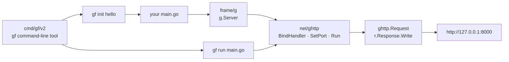

# gogf/gf

> **A modular Go application framework, for standing up an HTTP service without assembling your own stack.**

## The problem

Starting a service in Go usually means hand-gluing a router, a configuration layer, a logger, a
database access layer and a code generator, each from a different repository with its own
conventions. That glue gets rewritten on every project, and nothing guarantees the pieces age at
the same rate.

## What it actually does

GoFrame offers itself both as a complete application framework and as a set of components you
pick from — the README stresses that dual use: "full application framework, or pick individual
components as needed".

What the README actually shows at work is two bricks. `frame/g` is the global entry point:
`g.Server()` returns a server ready to configure. `net/ghttp` carries the HTTP server itself,
with `BindHandler` to attach a route to a function, `SetPort` for the port and `Run` to start;
the handler receives a `*ghttp.Request` and writes through `r.Response.Write`.

The repository also ships a separate command-line tool, `gf`, installed on its own from
`cmd/gf/v2`, which scaffolds a project (`gf init hello`) and runs it (`gf run main.go`).

The remaining components are not described in the README, which points to goframe.org and
pkg.go.dev instead. The displayed version is `v2.10.3`, and the repository advertises continuous
integration and coverage measurement.

## How it is wired

No code-derived diagram exists for this repository: the graph below is rebuilt from the README
alone, so it only shows the paths the README names.



## Trying it

```bash
go get -u github.com/gogf/gf/v2
```

```bash
go install github.com/gogf/gf/cmd/gf/v2@latest
```

After creating the README's example `main.go` (a server on port 8000):

```bash
go mod init hello
go mod tidy
go run main.go
```

Then open `http://127.0.0.1:8000`. To start from a skeleton instead of a hand-written file:

```bash
gf init hello
cd hello && gf run main.go
```

## Cost and gotchas

- **Free, MIT**, no API key, no account, no third-party service: the README states "100% free and
  open-source, forever".
- **Version floor**: `Go 1.23` or later is required. It is the only documented prerequisite, but
  it is recent and can block on a frozen toolchain.
- **Two separate installs**: the library (`go get`) and the `gf` tool (`go install`) do not come
  together; scaffolding only works after the second one.
- **The real cost is documentary.** The README describes neither configuration, nor the ORM, nor
  logging, nor validation: everything lives on goframe.org. Part of the material — the
  `goframe.org.cn` mirror, the offline docs — is in Chinese, and the site has a separate English
  version whose coverage the README does not guarantee.
- No GPU, no Docker, no particular RAM: it is a Go dependency compiled into the binary.

## What it is not

- **It is not a micro-router.** Using GoFrame as a `net/http` with routes means pulling in a whole
  framework to use 5% of it — the value sits in the components the README does not show.
- **It is not a repository-documented project**: the README stops at installation and a "Hello
  World". Everything else lives on an external site, with the usual drift risk and a dependency on
  translation.
- **It is not a data or AI tool**: it is a general-purpose web application framework, unrelated to
  training, inference or model orchestration.

## Alternatives

| | When to prefer it |
|---|---|
| **gofr-dev/gofr** | The other Go application framework in the catalogue. Prefer it when you want a narrower framework whose documentation lives in the repository itself; prefer GoFrame when you want a broad, pre-assembled stack and a scaffolding tool. |

The other catalogue neighbours (`VictoriaMetrics/VictoriaLogs`, `VictoriaMetrics/VictoriaMetrics`,
`netdata/netdata`) are Go observability systems, not application frameworks: no comparison holds.

## For you

Little direct value for a data / AI / MLOps profile: Python and Rust own that ground, and GoFrame
adds nothing on the model side. Worth watching only if your team already writes its infrastructure
services in Go and wants to stop re-gluing a router, a logger and an ORM on every new microservice.
