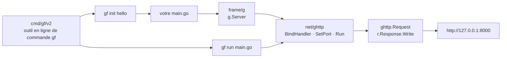

# gogf/gf

> **Cadre applicatif Go modulaire, pour monter un service HTTP sans assembler soi-même sa pile.**

## Le problème

En Go, démarrer un service revient d'ordinaire à recoller à la main un routeur, une couche de
configuration, un journal, un accès base de données et un outil de génération de code, chacun
venant d'un dépôt différent avec ses conventions. Le collage est refait à chaque projet, et
personne ne garantit que les morceaux vieillissent au même rythme.

## Ce que ça fait vraiment

GoFrame se présente comme un cadre applicatif complet *ou* comme un jeu de composants qu'on
prend à la carte : le README insiste sur ce double usage, « full application framework, or pick
individual components as needed ».

Ce que le README montre effectivement à l'œuvre tient en deux briques. `frame/g` est le point
d'entrée global : `g.Server()` rend un serveur prêt à configurer. `net/ghttp` porte le serveur
HTTP lui-même, avec `BindHandler` pour associer une route à une fonction, `SetPort` pour le
port et `Run` pour démarrer ; le handler reçoit un `*ghttp.Request` et écrit via
`r.Response.Write`.

Le dépôt livre en plus un outil en ligne de commande distinct, `gf`, installé séparément depuis
`cmd/gf/v2`, qui échafaude un projet (`gf init hello`) et le lance (`gf run main.go`).

Le reste des composants n'est pas décrit dans le README : celui-ci renvoie à goframe.org et à
pkg.go.dev. La version courante affichée est `v2.10.3`, et le dépôt annonce intégration
continue et mesure de couverture.

## Comment c'est branché

Aucun diagramme tiré du code n'existe pour ce dépôt : ce schéma est reconstruit depuis le seul
README, et ne montre donc que les chemins qu'il nomme.



## Essayer

```bash
go get -u github.com/gogf/gf/v2
```

```bash
go install github.com/gogf/gf/cmd/gf/v2@latest
```

Après avoir créé le `main.go` d'exemple du README (serveur sur le port 8000) :

```bash
go mod init hello
go mod tidy
go run main.go
```

Puis ouvrir `http://127.0.0.1:8000`. Pour partir d'un squelette plutôt que d'un fichier écrit à
la main :

```bash
gf init hello
cd hello && gf run main.go
```

## Coût et pièges

- **Gratuit, MIT**, sans clé d'API, sans compte, sans service tiers : le README affirme
  « 100% free and open-source, forever ».
- **Plancher de version** : `Go 1.23` ou plus récent est exigé. C'est le seul prérequis
  documenté, mais il est récent et peut bloquer sur une chaîne d'outils figée.
- **Deux installations distinctes** : la bibliothèque (`go get`) et l'outil `gf` (`go install`)
  ne viennent pas ensemble ; l'échafaudage ne marche qu'après la seconde.
- **Le coût réel est documentaire.** Le README ne décrit ni la configuration, ni l'ORM, ni le
  journal, ni la validation : tout passe par goframe.org. Une partie des ressources — miroir
  `goframe.org.cn`, documentation hors ligne — est en chinois, et le site a une version
  anglaise séparée dont la couverture n'est pas garantie par le README.
- Ni GPU, ni Docker, ni RAM particulière : c'est une dépendance Go compilée dans le binaire.

## Ce que ce n'est pas

- **Ce n'est pas un micro-routeur.** Prendre GoFrame pour remplacer un `net/http` avec routes,
  c'est importer un cadre entier pour en utiliser 5 % — l'intérêt est dans les composants que le
  README ne montre pas.
- **Ce n'est pas un projet documenté dans son dépôt** : le README se limite à l'installation et
  à un « Hello World ». Tout le reste vit sur un site externe, avec le risque de désynchronisation
  et de dépendance à une traduction.
- **Ce n'est pas un outil de données ni d'IA** : c'est un cadre applicatif web généraliste, sans
  rapport avec l'entraînement, l'inférence ou l'orchestration de modèles.

## Alternatives

| | Quand le préférer |
|---|---|
| **gofr-dev/gofr** | L'autre cadre applicatif Go du catalogue. À préférer quand on veut un cadre plus étroit et une documentation portée par le dépôt lui-même ; GoFrame à préférer quand on veut une pile large déjà assemblée et un outil d'échafaudage. |

Les autres voisins du catalogue (`VictoriaMetrics/VictoriaLogs`, `VictoriaMetrics/VictoriaMetrics`,
`netdata/netdata`) sont des systèmes d'observabilité écrits en Go, pas des cadres applicatifs :
aucune comparaison possible.

## Pour toi

Peu d'intérêt direct pour un profil data / IA / MLOps : Python et Rust tiennent ce terrain, et
GoFrame n'apporte rien côté modèles. À surveiller seulement si l'équipe écrit déjà ses services
d'infrastructure en Go et cherche à arrêter de recoller un routeur, un journal et un ORM à
chaque nouveau microservice.
