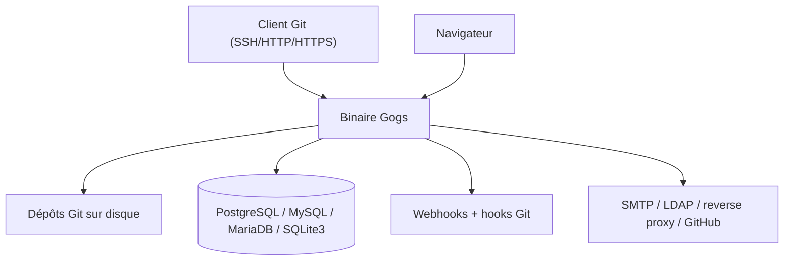

# gogs/gogs

> Forge Git auto-hébergée en Go, binaire unique, pour qui veut son GitHub privé.

## Le problème
Sans lui, héberger son propre Git suppose une pile lourde (base, runtime, reverse proxy) ou
l'acceptation d'un service tiers pour du code qu'on ne veut pas exposer.

## Ce que ça fait vraiment
Sert des dépôts en SSH, HTTP et HTTPS, avec issues, pull requests, wiki et branches protégées.
Gère utilisateurs, organisations, webhooks (Slack, Discord, Dingtalk), hooks Git, clés de déploiement
et Git LFS. Migre ou met en miroir des dépôts venus d'autres forges, wiki compris.
Rend les notebooks Jupyter et les PDF, et s'authentifie via SMTP, LDAP, reverse proxy ou GitHub avec 2FA.

## Comment c'est branché


## Essayer
```bash
# Aucune commande d'installation dans le README : il renvoie à la documentation
# et à des déploiements Cloudron, YunoHost, alwaysdata.
```

## Coût et pièges
Gratuit, rien à payer. Le README annonce un Raspberry Pi ou un droplet à 5 $ comme suffisant,
2 cœurs et 512 Mo de RAM pour une équipe. Une base de données externe est à prévoir hors SQLite.

## Ce que ce n'est pas
Ce n'est pas un GitHub complet : pas de CI intégrée décrite, et l'API est explicitement
« expérimentale ». Ce n'est pas non plus un service géré : la sauvegarde, les mises à jour
et l'exposition réseau restent à ta charge.

## Alternatives
Aucune alternative nommée dans le README.

## Pour toi
Utile si tu veux garder tes dépôts de notebooks et de pipelines chez toi sans maintenir GitLab.
