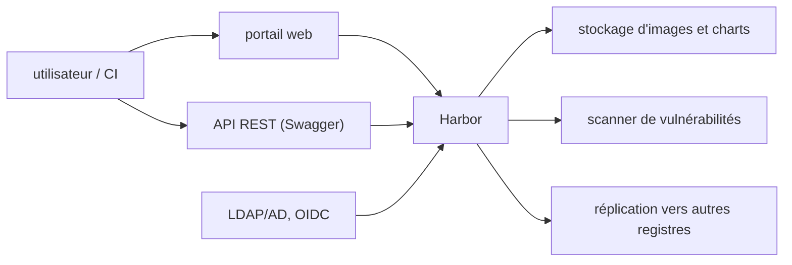

# goharbor/harbor

> Registre d'images et de charts auto-hébergé, avec scan de vulnérabilités et contrôle d'accès.

## Le problème
Un registre public ne donne ni contrôle d'accès fin, ni audit, ni scan systématique des images.
Tirer des images depuis un registre lointain ralentit les builds et les déploiements.

## Ce que ça fait vraiment
Étend Docker Distribution : images de conteneurs et charts Helm, organisés en « projets » avec droits par rôle.
Réplique les images entre registres selon des politiques filtrées (dépôt, tag, label), avec reprise sur erreur.
Scanne régulièrement les images et peut bloquer le déploiement d'une image vulnérable.
LDAP/AD, OIDC avec SSO, garbage collection, API REST avec Swagger embarqué, journal d'audit.

## Comment c'est branché


## Essayer
```bash
brew install sigstore/tap/cosign
cosign verify-blob \
  --bundle harbor-offline-installer-v2.15.0.tgz.sigstore.json \
  --certificate-oidc-issuer https://token.actions.githubusercontent.com \
  --certificate-identity-regexp '^https://github.com/goharbor/harbor/.github/workflows/publish_release.yml@refs/tags/v.*$' \
  harbor-offline-installer-v2.15.0.tgz
```

## Coût et pièges
Sur Linux : docker 20.10.10-ce+ et docker-compose 1.18.0+ ; sur Kubernetes, passer par le chart Harbor.
La branche `main` peut être instable : n'installer que depuis les releases.

## Ce que ce n'est pas
Ce n'est pas un service géré : c'est une infrastructure à opérer, sauvegarder et mettre à jour.
Ce n'est pas un scanner maison : Harbor branche des adaptateurs de scanners tiers.
Le dernier audit de sécurité externe cité date d'octobre 2019 (Cure53).

## Alternatives
Docker Distribution : le registre nu que Harbor étend, si l'on n'a besoin ni de droits ni de scan.

## Pour toi
Pertinent seulement si tu héberges toi-même tes images de modèles ; sinon un registre cloud suffit.
