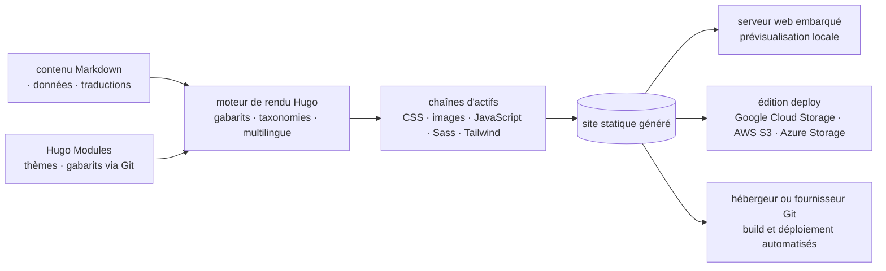

# gohugoio/hugo

> **Static site generator written in Go, for publishing docs, blogs or portfolios with no application server.**

## The problem

Publishing a content site — documentation, a blog, a portfolio — otherwise means running a CMS
with a database, or hand-assembling a chain of Markdown conversion, templating, CSS/JS/image
processing and local preview. Each piece is maintained separately, and going live depends on an
application server someone has to watch.

## What it actually does

Hugo renders a complete site into static files from content and templates. The README describes a
templating system, multilingual support and a taxonomy system, and lists as typical uses corporate,
government, nonprofit, education, news, event and project sites, documentation sites, image
portfolios, landing pages, blogs, resumes and CVs.

The asset pipelines the README claims cover:

- **CSS**: bundling, transformation, minification, source maps, SRI hashing, PostCSS integration.
- **Images**: convert, resize, crop, rotate, adjust colors, apply filters, overlay text and images, extract metadata.
- **JavaScript**: transpile TypeScript and JSX, bundle, tree shake, minify, source maps, SRI hashing.
- **Sass**: transpile to CSS, bundle, tree shake, minify, source maps, SRI hashing, PostCSS.
- **Tailwind CSS**: compile utility classes into standard CSS, then the same treatment.

An embedded web server handles preview during development. **Hugo Modules** let you share content,
assets, data, translations, themes, templates and configuration between projects through public or
private Git repositories.

The README leans on speed ("renders a complete site in seconds") and promotional wording ("fast",
"powerful taxonomy system"): none of it is quantified, and it is repeated here as a claim, not a
measurement.

## How it is wired

No code-derived diagram exists for this repository: the graph below is rebuilt from the README
alone, from the editions it describes, the asset pipelines it lists and the deployment targets it
mentions.



Rendering is a single pass: content and modules go in, templates and taxonomies decide the
structure, the asset pipelines handle CSS, JS, Sass and images, and the output is a directory of
static files you preview locally or push to a host. The *deploy* edition adds direct upload to a
cloud bucket; the *extended* edition adds embedded LibSass, deprecated in v0.153.0 and slated for
removal in favour of Dart Sass.

## Trying it

The README points to a prebuilt binary or the system package manager (macOS, Linux, Windows, BSD)
and gives no command line for that path. For building from source it requires Git and Go 1.26.0 or
later, and gives:

```sh
CGO_ENABLED=0 go install github.com/gohugoio/hugo@latest
```

```sh
CGO_ENABLED=0 go install -tags withdeploy github.com/gohugoio/hugo@latest
```

```sh
CGO_ENABLED=1 go install -tags extended github.com/gohugoio/hugo@latest
```

```sh
CGO_ENABLED=1 go install -tags extended,withdeploy github.com/gohugoio/hugo@latest
```

The last two require a C compiler such as GCC or Clang installed first. The README also gives
`hugo env --logLevel info` to list dependencies.

## Cost and traps

Nothing to pay, no account to create: the binary is enough, and the README mentions neither an API
key nor a mandatory third-party service. The traps are in picking an edition — there are four
(standard, deploy, extended, extended/deploy) and the README advises the standard one unless you
need more. The *extended* edition requires CGO and therefore a C compiler, which complicates CI
builds; its embedded LibSass has been deprecated since v0.153.0 and will be removed, so a move to
Dart Sass is due. The *deploy* edition only makes sense with a Google Cloud Storage, AWS S3 or
Azure Storage bucket, whose bill is yours. The README lists over a hundred and fifty bundled
dependencies, including AWS, Azure and Google SDKs, plus libraries shipped in binary or WASM form
(libwebp, KaTeX, QuickJS) under their own licenses — worth a look if compliance matters. Finally,
support goes through the forum, not the issue queue, which is explicitly reserved for confirmed
software defects.

## What it is not

It is not a CMS: there is no admin interface, no database, no user accounts — content is a file
tree you edit and version yourself (sponsors such as CloudCannon sell a CMS layer on top; that is
not Hugo). It is not a host either: Hugo produces files, and publishing them remains yours to
organise unless you use the *deploy* edition against a bucket. It is not an application framework:
the generated site has no server-side logic, and any dynamic behaviour goes to client-side
JavaScript or an external service. Lastly, the reference documentation does not live in this
repository but in `gohugoio/hugoDocs`, where documentation issues and pull requests belong.

## Alternatives

- **decaporg/decap-cms** — complementary rather than competing: it adds an editing interface on top
  of a static site generator, worth a look if editing Markdown files blocks non-technical writers.
- None of the other supplied neighbours is comparable: PostHog is a product analytics platform,
  go-gitea a self-hosted Git forge, sammwyy/MikuMikuBeam is unrelated. The README itself names no
  competing generator.

## For you

For a data / AI / MLOps profile, this is the tool that publishes a project's or an internal
platform's documentation with nothing to operate in production: one binary, a Git repository, a CI
job, and the site comes out as files. Worth adopting for technical docs, a team blog or a project
showcase; pointless if you need a stateful application, user accounts or content generated on the
fly.
