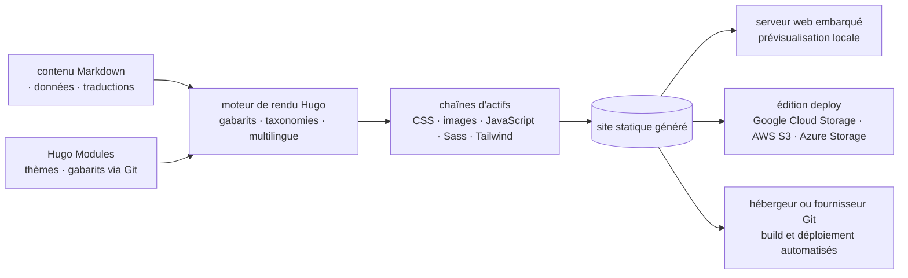

# gohugoio/hugo

> **Générateur de sites statiques en Go, pour publier documentation, blog ou portfolio sans serveur applicatif.**

## Le problème

Publier un site de contenu — documentation, blog, portfolio — impose sinon de faire tourner un
CMS avec base de données, ou d'assembler à la main une chaîne de conversion Markdown, de
gabarits, de traitement CSS/JS/images et de prévisualisation locale. Chaque brique se maintient
séparément, et la mise en ligne dépend d'un serveur applicatif à surveiller.

## Ce que ça fait vraiment

Hugo rend un site complet en fichiers statiques à partir de contenus et de gabarits. Le README
décrit un système de gabarits, un support multilingue et un système de taxonomies, et cite comme
usages courants les sites d'entreprise, d'administration, d'association, d'éducation, de presse,
les sites de documentation, portfolios d'images, pages d'atterrissage, blogs et CV.

Les chaînes d'actifs annoncées par le README couvrent :

- **CSS** : regroupement, transformation, minification, source maps, empreintes SRI, intégration PostCSS.
- **Images** : conversion, redimensionnement, recadrage, rotation, réglage des couleurs, filtres,
  incrustation de texte et d'images, extraction de métadonnées.
- **JavaScript** : transpilation TypeScript et JSX, regroupement, tree shaking, minification, source maps, SRI.
- **Sass** : transpilation vers CSS, regroupement, tree shaking, minification, source maps, SRI, PostCSS.
- **Tailwind CSS** : compilation des classes utilitaires en CSS standard, puis même traitement.

Un serveur web embarqué sert à la prévisualisation pendant le développement. Les **Hugo Modules**
permettent de partager contenus, actifs, données, traductions, thèmes, gabarits et configuration
entre projets via des dépôts Git publics ou privés.

Le README insiste sur la vitesse (« renders a complete site in seconds ») et emploie des termes
promotionnels (« fast », « powerful taxonomy system ») : ces affirmations ne sont pas chiffrées
et sont reprises ici comme déclaration, pas comme mesure.

## Comment c'est branché

Aucun diagramme tiré du code n'existe pour ce dépôt : ce schéma est reconstruit depuis le seul
README, à partir des éditions décrites, des chaînes d'actifs listées et des cibles de déploiement
mentionnées.



Le rendu est un passage unique : contenus et modules entrent, gabarits et taxonomies décident de
la structure, les chaînes d'actifs traitent CSS, JS, Sass et images, et la sortie est un
répertoire de fichiers statiques que l'on prévisualise localement ou que l'on pousse chez un
hébergeur. L'édition *deploy* ajoute l'envoi direct vers un bucket cloud ; l'édition *extended*
ajoute LibSass embarqué, déprécié en v0.153.0 et destiné à disparaître au profit de Dart Sass.

## Essayer

Le README renvoie à un binaire pré-compilé ou au gestionnaire de paquets du système (macOS,
Linux, Windows, BSD) et ne donne pas de ligne de commande pour ce chemin-là. Pour la compilation
depuis les sources, il exige Git et Go 1.26.0 ou plus récent, et donne :

```sh
CGO_ENABLED=0 go install github.com/gohugoio/hugo@latest
```

```sh
CGO_ENABLED=0 go install -tags withdeploy github.com/gohugoio/hugo@latest
```

```sh
CGO_ENABLED=1 go install -tags extended github.com/gohugoio/hugo@latest
```

```sh
CGO_ENABLED=1 go install -tags extended,withdeploy github.com/gohugoio/hugo@latest
```

Les deux dernières exigent au préalable un compilateur C tel que GCC ou Clang. Le README donne
aussi `hugo env --logLevel info` pour afficher la liste des dépendances.

## Coût et pièges

Rien à payer, rien à créer comme compte : le binaire suffit et le README ne mentionne ni clé
d'API ni service tiers obligatoire. Les pièges sont dans le choix de l'édition — il y en a quatre
(standard, deploy, extended, extended/deploy) et le README conseille la standard sauf besoin
précis. L'édition *extended* impose CGO et donc un compilateur C, ce qui complique la compilation
en CI ; son LibSass embarqué est déprécié depuis la v0.153.0 et sera retiré, la migration vers
Dart Sass est à prévoir. L'édition *deploy* n'a de sens qu'avec un bucket Google Cloud Storage,
AWS S3 ou Azure Storage, dont la facture reste à ta charge. Le README liste plus de cent cinquante
dépendances embarquées, dont des SDK AWS, Azure et Google, ainsi que des bibliothèques en binaire
ou WASM (libwebp, KaTeX, QuickJS) sous leurs propres licences — à regarder si la conformité
compte. Enfin, le support passe par le forum et non par la file d'issues, explicitement réservée
aux défauts logiciels avérés.

## Ce que ce n'est pas

Ce n'est pas un CMS : il n'y a ni interface d'administration, ni base de données, ni comptes
utilisateurs — le contenu est une arborescence de fichiers que l'on édite et versionne soi-même
(des sponsors comme CloudCannon proposent une couche CMS par-dessus, ce n'est pas Hugo). Ce n'est
pas un hébergeur non plus : Hugo produit des fichiers, la mise en ligne reste à organiser, sauf à
utiliser l'édition *deploy* vers un bucket. Ce n'est pas un framework d'application : le site
généré n'a pas de logique côté serveur, tout dynamisme se règle en JavaScript côté client ou via
un service externe. Enfin, la documentation de référence ne vit pas dans ce dépôt mais dans
`gohugoio/hugoDocs`, et les issues ou PR de documentation doivent y être déposées.

## Alternatives

- **decaporg/decap-cms** — complémentaire plutôt que concurrent : ajoute une interface d'édition
  par-dessus un générateur statique, à regarder si l'édition par fichiers Markdown bloque les
  rédacteurs non techniques.
- Aucun autre voisin fourni n'est comparable : PostHog est une plateforme d'analytique produit,
  go-gitea une forge Git auto-hébergée, sammwyy/MikuMikuBeam n'a rien à voir. Le README lui-même
  ne nomme aucun générateur concurrent.

## Pour toi

Pour un profil data / IA / MLOps, c'est l'outil qui publie la documentation d'un projet ou d'une
plateforme interne sans rien à exploiter en production : un binaire, un dépôt Git, une CI, et le
site sort en fichiers. À adopter pour de la doc technique, un blog d'équipe ou une vitrine de
projet ; sans intérêt si le besoin est une application avec état, des comptes ou du contenu
généré à la volée.
