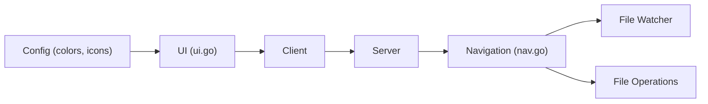

# gokcehan/lf

> Gestionnaire de fichiers en terminal écrit en Go, inspiré de ranger, pour utilisateurs du shell.

## Le problème
Naviguer et manipuler des fichiers en terminal avec les commandes de base est lent ; les gestionnaires plus lourds ont des dépendances.

## Ce que ça fait vraiment
Binaire statique sans dépendance d'exécution, multiplateforme. Entrées/sorties asynchrones, architecture client/serveur pour piloter plusieurs instances, raccourcis vi ou readline, configuration par commandes shell. Ne propose volontairement ni onglets, ni pager ou éditeur intégrés, ni commandes de fichiers propres.

## Comment c'est branché


## Essayer
```bash
env CGO_ENABLED=0 go install -trimpath -ldflags="-s -w" github.com/gokcehan/lf@latest
lf
lf -help
lf -doc
```

## Coût et pièges
Gratuit. Compiler demande Go ; sinon des binaires et paquets communautaires existent. Peu d'intégrations natives : il faut les écrire dans la configuration.

## Ce que ce n'est pas
Pas un explorateur graphique : pas de tabs ni d'opérations de fichiers propres, tout passe par les outils du shell.

## Alternatives
ranger, cité comme source d'inspiration.

## Pour toi
À surveiller : agréable pour parcourir des jeux de données sur un serveur en SSH, mais ce n'est qu'un confort, pas un outil de ton métier.

