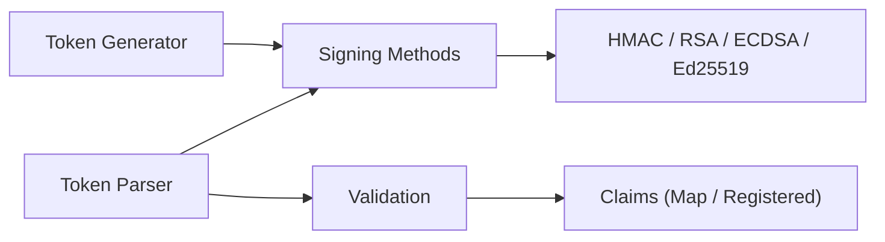

# golang-jwt/jwt

> Implémentation Go des JSON Web Tokens pour signer, analyser et vérifier des jetons d'authentification.

## Le problème
Manipuler des JWT à la main est risqué : mauvaise vérification de l'algorithme, jetons non signés acceptés par erreur.

## Ce que ça fait vraiment
Crée, signe, analyse et valide des JWT. Signatures HMAC SHA, RSA, RSA-PSS, ECDSA (et Ed25519 d'après l'architecture décrite). Les jetons `alg=none` ne sont acceptés qu'avec la constante `UnsafeAllowNoneSignatureType`. Points d'extension : `SigningMethod` et `Keyfunc`, ce qui permet KMS cloud, HSM ou JWKS via des extensions tierces. Un utilitaire `cmd/jwt` aide au débogage.

## Comment c'est branché


## Essayer
```sh
go get -u github.com/golang-jwt/jwt/v5
```
```go
import "github.com/golang-jwt/jwt/v5"
```

## Coût et pièges
Gratuit. Il faut vérifier soi-même que l'algorithme présenté est celui attendu. La v5 n'est pas entièrement rétrocompatible : un guide de migration existe.

## Ce que ce n'est pas
Ce n'est pas un système d'authentification complet : ni gestion d'utilisateurs, ni sessions, ni OAuth.

## Alternatives
Aucune alternative nommée dans le README.

## Pour toi
À adopter si tu écris des services Go (API de modèles, passerelles) qui vérifient des jetons : standard de fait, MIT, activement maintenu.

