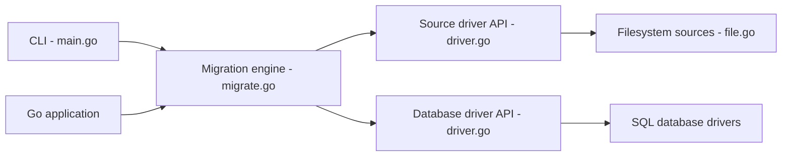

# golang-migrate/migrate

> Outil et bibliothèque Go de migrations de bases de données versionnées, en CLI ou importé.

## Le problème
Faire évoluer le schéma d'une base de façon ordonnée, réversible et reproductible entre environnements.

## Ce que ça fait vraiment
Lit des migrations `up`/`down` depuis des sources (système de fichiers, `io/fs`, GitHub, GitLab, Bitbucket, S3, GCS) et les applique dans l'ordre via un pilote de base (PostgreSQL, MySQL, SQLite, MongoDB, ClickHouse, CockroachDB, Cassandra, SQL Server…). Arrêt propre `GracefulStop`, sans goroutine qui fuit. Les pilotes sont volontairement « bêtes » : en cas de doute, échec.

## Comment c'est branché


## Essayer
```bash
migrate -source file://path/to/migrations -database postgres://localhost:5432/database up 2
docker run -v {{ migration dir }}:/migrations --network host migrate/migrate -path=/migrations/ -database postgres://localhost:5432/database up 2
```

## Coût et pièges
Gratuit. Caractères réservés dans l'URL de connexion à échapper. La v3 n'est plus supportée ; utiliser la v4.

## Ce que ce n'est pas
Pas un ORM ni un générateur de migrations : les fichiers SQL sont à écrire. Certains pilotes sont marqués « todo ». Licence non identifiée par GitHub.

## Alternatives
- migradaptor : pour venir d'un autre outil, non affilié au projet.

## Pour toi
À adopter pour versionner le schéma de tes bases applicatives ou de métadonnées ML (fichiers up/down, CI) : simple et multi-bases.

