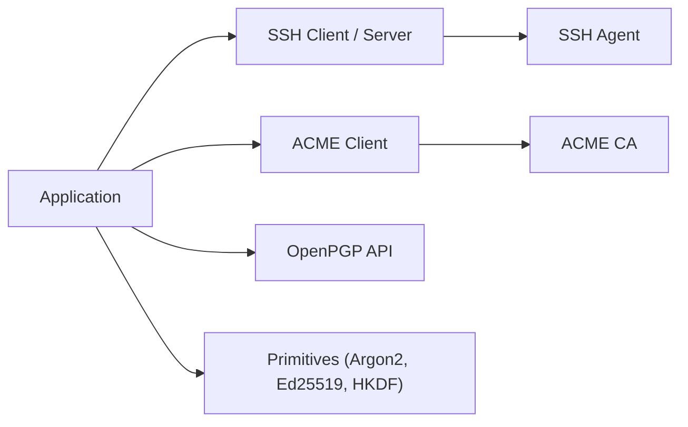

# golang/crypto

> Paquets cryptographiques complémentaires de Go : SSH, ACME, OpenPGP, dérivation de clés, primitives.

## Le problème
La bibliothèque standard de Go ne couvre pas tous les protocoles et primitives cryptographiques courants.

## Ce que ça fait vraiment
README minimal (moins de 800 caractères) : il donne surtout la marche à suivre pour contribuer via Gerrit. D'après l'architecture : clients et serveurs SSH, agent SSH, client ACME, OpenPGP, OTR, Argon2, ChaCha20-Poly1305, Ed25519, Curve25519, HKDF et racines de confiance.

## Comment c'est branché

## Essayer
Aucune commande dans le README. Le README indique seulement le dépôt Git `https://go.googlesource.com/crypto` et le suivi des issues sur go.dev/issues.

## Coût et pièges
Gratuit. Les contributions passent par Gerrit, avec un examen renforcé, donc lent.

## Ce que ce n'est pas
Pas un produit. Ne pas confondre avec la bibliothèque standard `crypto`.

## Alternatives
Aucune alternative nommée dans le README.

## Pour toi
À adopter si tu écris du Go : c'est la source officielle, maintenue par l'équipe Go. Fiche minimale, le README étant très court.

