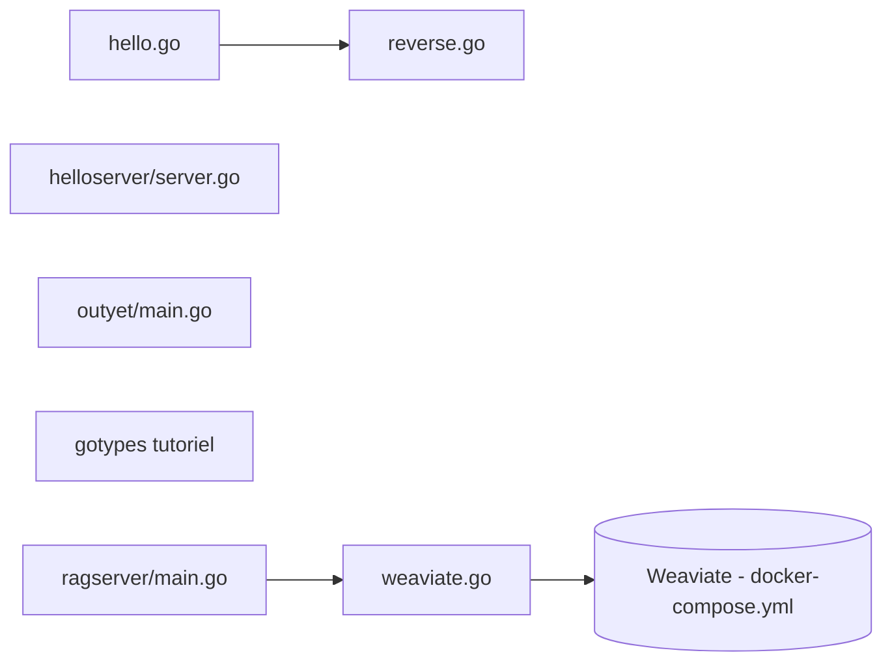

# golang/example

> Recueil de petits programmes Go officiels pour apprendre le langage, la bibliothèque standard et les outils.

## Le problème
Apprendre Go demande des exemples courts, corrects et écrits par l'équipe du langage plutôt que des tutoriels épars.

## Ce que ça fait vraiment
Le dépôt regroupe des exemples indépendants : `hello` et sa bibliothèque `reverse`, `helloserver`, `outyet` (serveur avec templates, `expvar`, synchronisation), `template`, `appengine-hello`, un tutoriel `gotypes` sur `go/types`, un guide de handlers `slog`. Le code décrit ajoute des serveurs RAG (`ragserver`, variantes Genkit et LangChainGo) qui s'appuient sur Weaviate, lancé via docker-compose pour les tests.

## Comment c'est branché


## Essayer
```bash
git clone https://go.googlesource.com/example
cd example
cd hello
go build
./hello -help
cd helloserver
go run .
```

## Coût et pièges
Gratuit. Pour les serveurs RAG, Weaviate est requis pour l'intégration ; le README ne documente pas ces serveurs (ils apparaissent seulement dans l'architecture du code).

## Ce que ce n'est pas
Ce n'est pas un framework ni une dépendance à importer : chaque dossier est un exemple pédagogique. Les étapes de `slog-handler-guide` sont des paliers d'apprentissage, pas du code à réutiliser tel quel.

## Alternatives
Aucune alternative nommée dans le README.

## Pour toi
À surveiller : utile comme référence si tu apprends Go, mais rien de spécifique data/IA, hormis les exemples RAG non documentés.

