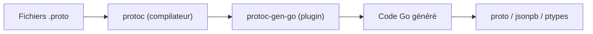

# golang/protobuf

> Module Go pour manipuler des messages Protocol Buffers et générer le code Go avec `protoc-gen-go`.

## Le problème
Lire, écrire et convertir des messages protobuf en Go demande une bibliothèque d'exécution et un générateur de code.

## Ce que ça fait vraiment
Paquets `proto` (clonage, fusion, égalité, sérialisation binaire et texte), `jsonpb` (JSON), `ptypes` (types connus : Any, Timestamp, Duration…) et le binaire `protoc-gen-go`, plugin du compilateur `protoc`. Le README précise ce qui peut casser : sécurité, comportement non spécifié, changements de spécification, bogues, ajouts générés, code interne.

## Comment c'est branché

## Essayer
Aucune commande documentée dans le README : il liste les paquets et les règles de compatibilité.

## Coût et pièges
Gratuit. Les ruptures de compatibilité hors zones réservées sont annoncées six mois à l'avance sur la liste `protobuf@googlegroups.com`. Un rapport de bogue doit indiquer la version du module et de la chaîne protobuf.

## Ce que ce n'est pas
Pas un compilateur protobuf : `protoc` reste nécessaire. Le README ne compare pas avec d'autres modules.

## Alternatives
Aucune alternative nommée dans le README.

## Pour toi
À ignorer sauf si tu écris du Go : pour du Python data/IA, la couche protobuf est fournie par d'autres bibliothèques.

