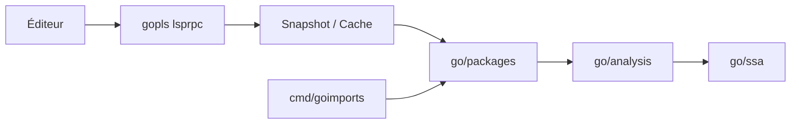

# golang/tools

> Module golang.org/x/tools : analyse statique de Go, outils en ligne de commande et serveur gopls.

## Le problème
Analyser, formater et outiller du code Go (imports, graphes d'appels, LSP) demande des briques partagées.

## Ce que ça fait vraiment
Fournit `goimports`, `callgraph`, `stringer`, `digraph`, `toolstash`, et des paquets `go/ssa`, `go/packages`, `go/analysis`, `go/callgraph`, `go/cfg`. Le module `gopls` est le serveur LSP pour VS Code, Vim, etc.

## Comment c'est branché


## Essayer
```bash
go install golang.org/x/tools/cmd/goimports@latest
```

## Coût et pièges
Gratuit. Gopls a de la télémétrie interne (dossier `gopls/internal/telemetry`), non détaillée dans le README.

## Ce que ce n'est pas
Pas un outil pour Python ni pour l'IA ; c'est de l'outillage Go.

## Alternatives
Aucune alternative nommée dans le README.

## Pour toi
Ignorer sauf si tu écris du Go : rien d'utile pour un profil data/IA/MLOps hors de ce langage.

