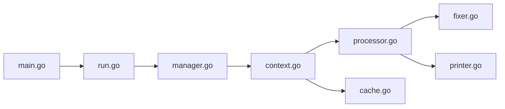

# golangci/golangci-lint

> Exécuteur parallèle de linters Go avec cache et configuration YAML, pour développeurs Go.

## Le problème
Lancer séparément des dizaines de linters Go est lent et difficile à configurer de façon homogène.

## Ce que ça fait vraiment
La commande `run` charge la configuration, sélectionne les linters, analyse les paquets en parallèle (avec cache), traite les problèmes trouvés et imprime les résultats dans le format choisi. Plus de cent linters, correctifs automatiques, commande de formatage et migration de configuration. Intégré aux principaux IDE. Le README fourni est très court : la doc est sur golangci-lint.run.

## Comment c'est branché


## Essayer
```bash
# Aucune commande dans le README fourni (il renvoie à la page d'installation en ligne).
```

## Coût et pièges
Gratuit. Licence GPL-3.0 : sans conséquence pour un outil qu'on exécute, à vérifier si on l'embarque.

## Ce que ce n'est pas
Pas un analyseur de types ni un testeur : il agrège des linters.

## Alternatives
Aucune alternative nommée dans le README.

## Pour toi
À adopter seulement si tu écris du Go (outils MLOps, opérateurs Kubernetes) ; sinon sans objet.

