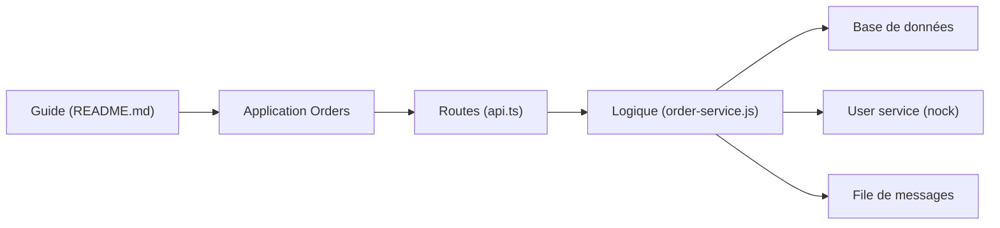

# goldbergyoni/nodejs-testing-best-practices

> Guide de plus de 50 bonnes pratiques de tests de composants pour backends Node.js, avec application d'exemple.

## Le problème
Les équipes écrivent soit trop de tests unitaires fragiles, soit des tests E2E lents ; peu d'approches intermédiaires réalistes sont documentées.

## Ce que ça fait vraiment
Le README est organisé en huit sections : stratégie (commencer par des tests de composant, quelques E2E), infrastructure (base réelle en docker-compose, schéma par migrations), serveur de test dans le même processus, anatomie des tests, intégrations (interception HTTP avec nock, chaos réseau), données, files de messages (faux MQ, idempotence, messages empoisonnés) et mocks. Une application « Orders » et des recettes (Nest.js, Mocha, OpenAPI) illustrent.

## Comment c'est branché


## Essayer
```bash
# Aucune commande d'installation dans le README.
# Extraits : dockerCompose.upAll() en globalSetup Jest,
# nock.disableNetConnect() pour bloquer les appels sortants.
```

## Coût et pièges
Gratuit ; Docker pour reproduire la base de test. Plusieurs exemples sont marqués « TODO », certaines sections sont incomplètes et le README se termine par du texte parasite. Aucune licence déclarée. Des cours payants de l'auteur sont mis en avant.

## Ce que ce n'est pas
Pas un framework ni une bibliothèque de test. Ciblé backend Node.js : pas d'indications pour du Python ou du ML.

## Alternatives
Non documenté dans le README (renvoie au guide sœur sur les tests unitaires de l'auteur, sans le nommer).

## Pour toi
Les principes (tests de composant, base réelle, faux de file de messages) se transposent à un service d'inférence ; à lire, mais pas à adopter tel quel si tu n'écris pas de Node.

