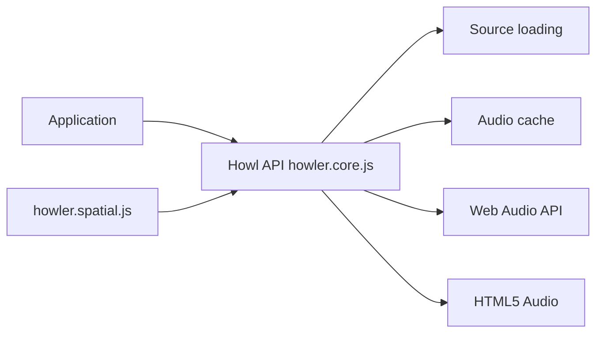

# goldfire/howler.js

> Bibliothèque audio pour le web, avec une API unique sur Web Audio et HTML5 Audio, pour développeurs front-end.

## Le problème
Les navigateurs gèrent l'audio de façon inégale : codecs, verrouillage mobile, mise en cache.

## Ce que ça fait vraiment
Charge et lit des sons avec Web Audio par défaut et repli HTML5 Audio. Gère les sprites sonores, les fondus, la vitesse, la position de lecture, le groupe de sons et le déverrouillage automatique sur mobile. Le plugin spatial ajoute panoramique stéréo et son 3D. Sans dépendance ; environ 7 ko gzippés selon le README.

## Comment c'est branché


## Essayer
```bash
npm install howler
```
```js
var sound = new Howl({ src: ['sound.webm', 'sound.mp3'] });
sound.play();
```

## Coût et pièges
Gratuit. Sur mobile, l'audio reste verrouillé tant qu'aucune interaction n'a eu lieu. Les sources sont essayées dans l'ordre : mettre webm avant mp3. Dernier push en novembre 2025.

## Ce que ce n'est pas
Pas un outil de traitement ni de synthèse audio : c'est un lecteur. Un fichier Howl ne contient qu'un seul fichier audio.

## Alternatives
Aucune alternative nommée dans le README.

## Pour toi
Surveiller : utile pour ajouter des sons à une démo web ; aucun apport pour l'analyse audio ou l'IA vocale.

