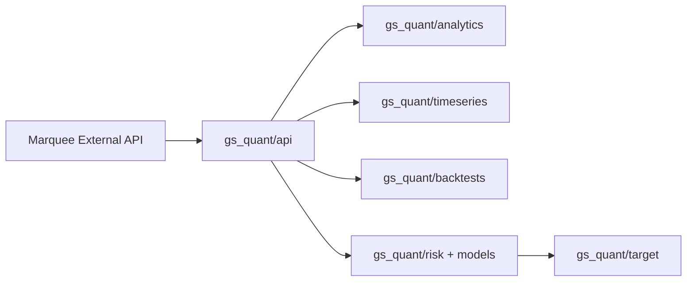

# goldmansachs/gs-quant

> Boîte à outils Python de finance quantitative de Goldman Sachs, pour quants clients institutionnels.

## Le problème
Développer des stratégies de trading et de gestion du risque sur dérivés exige des outils d'analyse et un accès aux données de marché.

## Ce que ça fait vraiment
Paquet `gs_quant` avec modules API (sessions, actifs), analytics, séries temporelles, backtests, marchés, instruments, risque, modèles et rapports. Les appels d'API passent par la plateforme Marquee de Goldman Sachs, qui exige un identifiant client et un secret réservés aux clients institutionnels. Le README n'en dit pas plus.

## Comment c'est branché


## Essayer
```bash
pip install gs-quant
```

## Coût et pièges
Python 3.9 ou plus. Les API exigent un identifiant et un secret obtenus auprès de l'équipe commerciale de Goldman Sachs : sans compte client, l'essentiel ne fonctionne pas. Le README annonce 3.9 et le code 3.8 : incohérence de version.

## Ce que ce n'est pas
Pas un outil autonome ni ouvert à tous : c'est un client d'une plateforme réservée à des clients institutionnels.

## Alternatives
Aucune alternative citée dans le README.

## Pour toi
À surveiller : pertinent seulement si ton organisation est cliente de Goldman Sachs ; sinon, inutilisable sans accès à Marquee.

