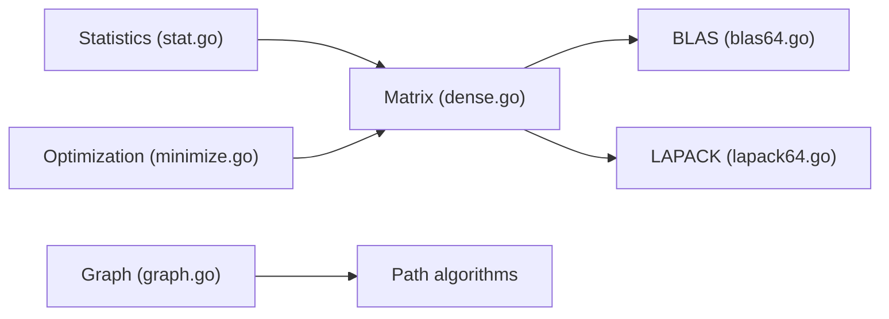

# gonum/gonum

> Suite de calcul numérique et scientifique en Go : algèbre linéaire, graphes, statistiques, optimisation.

## Le problème
Go n'a pas d'équivalent natif de NumPy/SciPy pour le calcul scientifique.

## Ce que ça fait vraiment
Paquets en Go pur (avec un peu d'assembleur) : BLAS/LAPACK et matrices denses, graphes (algorithmes, formats), statistiques et distributions, optimisation, FFT, intégration numérique, différences finies, interpolation, fonctions spéciales. Tags de compilation (`safe`, `noasm`, `bounds`). Versions tous les six mois, alignées sur Go.

## Comment c'est branché


## Essayer
```bash
go get -u gonum.org/v1/gonum/...
```

## Coût et pièges
Gratuit. Versions encore en v0.x. 256 issues ouvertes. README minimal : la doc est ailleurs.

## Ce que ce n'est pas
Pas de deep learning ni d'écosystème dataframe comparable à Python.

## Alternatives
Aucune nommée dans le README.

## Pour toi
À surveiller : pertinent seulement pour des services de calcul en Go ; en Python, reste sur NumPy/SciPy.

