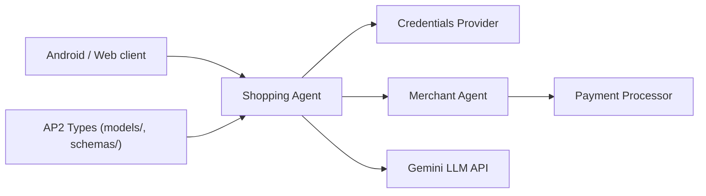

# google-agentic-commerce/AP2

> Exemples et SDK d'un protocole de paiement pour agents, avec scénarios Python, Go et Android.

## Le problème
Quand un agent achète pour un utilisateur, il faut des objets standard pour prouver le mandat, le panier et le moyen de paiement.

## Ce que ça fait vraiment
Dépôt d'exemples et de spécification : SDK Python (`code/sdk/python/ap2/`, modèles Pydantic et schémas JSON), scénarios exécutables (`run.sh`), et rôles séparés : agent d'achat, agent marchand, fournisseur de credentials, processeur de paiement. Les échantillons utilisent ADK et un modèle Gemini, mais le protocole n'y est pas lié. Le paquet PyPI n'est pas encore publié.

## Comment c'est branché


## Essayer
```bash
export GOOGLE_API_KEY='your_key'
bash code/samples/python/scenarios/a2a/human-present/cards/run.sh
uv pip install git+https://github.com/google-agentic-commerce/AP2.git@main
```

## Coût et pièges
Clé Google AI Studio ou Vertex AI requise, donc appels facturables. Ce sont des démonstrations, pas un système de paiement réel.

## Ce que ce n'est pas
Pas un produit de paiement ni une passerelle : il décrit et illustre un protocole. Le README ne parle d'aucune certification.

## Alternatives
Non documenté dans le README.

## Pour toi
Surveiller : à lire si tu conçois des agents qui agissent avec de l'argent ; trop tôt (SDK non publié) pour l'utiliser.
