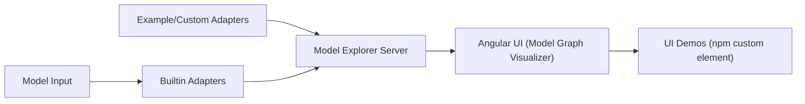

# google-ai-edge/model-explorer

> Visualiseur hiérarchique de graphes de modèles (TFLite, TF, PyTorch) pour comprendre et déboguer des réseaux.

## Le problème
Un graphe de modèle de milliers d'opérations est illisible à plat ; retrouver une couche ou comparer des blocs identiques est pénible.

## Ce que ça fait vraiment
Organise les opérations en couches imbriquées repliables, avec recherche, surlignage des entrées/sorties, métadonnées superposées sur les nœuds, fenêtres contextuelles, blocs identiques, rendu accéléré par GPU. Formats : TFLite, TF, TFJS, MLIR, PyTorch (Exported Program). Des adaptateurs personnalisés ajoutent d'autres formats. Le composant est aussi disponible en paquet npm, et utilisable dans Colab.

## Comment c'est branché


## Essayer
```shell
pip install ai-edge-model-explorer
model-explorer
```

## Coût et pièges
Gratuit ; Python requis, version exacte non précisée dans le README. La version Hugging Face n'affiche que les modèles téléversés. Certaines limites sont listées dans le wiki.

## Ce que ce n'est pas
Pas un outil d'entraînement ni de profilage de performance : il montre la structure.

## Alternatives
Aucune alternative nommée dans le README.

## Pour toi
À adopter : gratuit, installable en une commande, précieux pour inspecter ou déboguer des modèles exportés.

