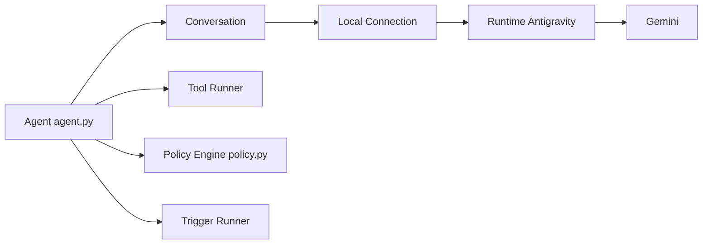

# google-antigravity/antigravity-sdk-python

> SDK Python de Google pour construire des agents adossés à Gemini, avec outils, politiques et déclencheurs.

## Le problème
Écrire la boucle d'agent (état, outils, garde-fous, flux) à chaque projet est répétitif et risqué.

## Ce que ça fait vraiment
`Agent` gère le cycle de vie derrière un gestionnaire de contexte asynchrone : découverte du binaire, outils Python, serveurs MCP, hooks et politiques (`deny`, `allow`, `ask_user`), déclencheurs périodiques. `Conversation` garde l'historique ; une couche de connexion locale dialogue avec un binaire d'exécution fourni dans la roue. Réponses en flux, pensées et appels d'outils inclus. Par défaut l'agent est en lecture seule ; Vertex est pris en charge.

## Comment c'est branché


## Essayer
```bash
pip install google-antigravity
export GEMINI_API_KEY="your_api_key_here"
python ./examples/getting_started/hello_world.py
```

## Coût et pièges
Clé Gemini ou compte Vertex facturé à ta charge. Le SDK exige un binaire compilé publié dans les roues PyPI : cloner le dépôt ne suffit pas, et ce binaire n'est pas auditable ici.

## Ce que ce n'est pas
Pas un cadre indépendant du fournisseur : il est conçu pour Gemini et l'exécution Antigravity. Les intégrations sont décrites par le README plus que par du code relu.

## Alternatives
Aucune alternative n'est citée dans le README.

## Pour toi
À surveiller : le système de politiques par outil est bien pensé, mais binaire fermé, projet d'avril 2026 et lien exclusif avec Google.
