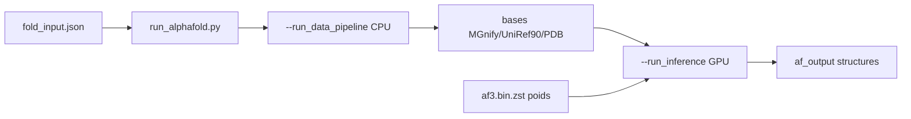

# google-deepmind/alphafold3

> Pipeline d'inférence d'AlphaFold 3 pour prédire la structure d'interactions biomoléculaires.

## Le problème
Prédire la structure d'un complexe protéine-ligand ou protéine-acide nucléique demandait des méthodes séparées et des mois de travail expérimental.

## Ce que ça fait vraiment
Fournit le code complet d'inférence d'AlphaFold 3 ; les poids sont distribués séparément.
Prend en entrée un JSON décrivant séquences, graines de modèle et dialecte.
Sépare deux étapes pilotables par drapeaux : `--run_data_pipeline` (recherche génétique et de templates, CPU uniquement, lent) et `--run_inference` (GPU).
S'exécute via une image Docker montant entrées, sorties, modèles et bases publiques.

## Comment c'est branché


## Essayer
```bash
docker run -it \
    --volume $HOME/af_input:/root/af_input \
    --volume $HOME/af_output:/root/af_output \
    --gpus all \
    alphafold3 \
    python run_alphafold.py \
    --json_path=/root/af_input/fold_input.json \
    --model_dir=/root/models \
    --output_dir=/root/af_output
```

## Coût et pièges
Le code est Apache 2.0 mais les paramètres du modèle sont soumis à des conditions distinctes et ne sont utilisables que s'ils viennent directement de Google. Le pipeline de données exige les bases mirrorées, plusieurs centaines de Go. GPU obligatoire pour l'inférence.

## Ce que ce n'est pas
Pas utilisable cliniquement : le README écrit explicitement que le modèle et ses sorties ne sont ni validés ni approuvés pour un usage clinique. Pas libre au sens usuel : les poids portent leurs propres termes. Pas un entraînement : seule l'inférence est fournie.

## Alternatives
alphafoldserver.com — la version hébergée, non commerciale, avec moins de ligands et de modifications covalentes.

## Pour toi
À connaître comme référence du domaine ; l'infrastructure requise le réserve à un usage bio spécialisé.
