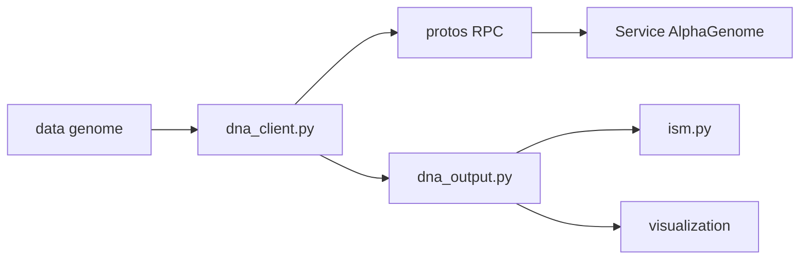

# google-deepmind/alphagenome

> Client Python de l'API AlphaGenome pour prédire l'effet de variants dans l'ADN régulateur, pour chercheurs en génomique.

## Le problème
Prédire l'expression génique, l'épissage ou la chromatine à partir de séquences d'ADN de 1 Mpb, sans entraîner son propre modèle.

## Ce que ça fait vraiment
Le dépôt ne contient ni poids ni entraînement : c'est un SDK client. Objets génomiques (intervalle, variant, transcrit, ontologie), client `dna_client` qui appelle le service distant en RPC (protobuf), scoring de variants, mutagenèse in silico, visualisation matplotlib et notebooks Colab. L'API est gratuite en usage non commercial.

## Comment c'est branché


## Essayer
```bash
git clone https://github.com/google-deepmind/alphagenome.git
pip install ./alphagenome
```
```python
model = dna_client.create(API_KEY)
```

## Coût et pièges
Clé d'API requise, gratuite en non commercial ; quotas variables, inadaptée à plus d'un million de prédictions. Les sorties ne servent pas à entraîner d'autres modèles ni à la décision clinique. Usage commercial via Google Cloud.

## Ce que ce n'est pas
Pas un modèle local : sans service distant, rien ne tourne. Le code est Apache-2.0 mais les sorties ont des conditions d'usage restrictives.

## Alternatives
Aucune alternative nommée dans le README.

## Pour toi
À surveiller : intéressant pour la bio-informatique, mais dépendance à un service et interdiction de réutiliser les sorties pour entraîner.

