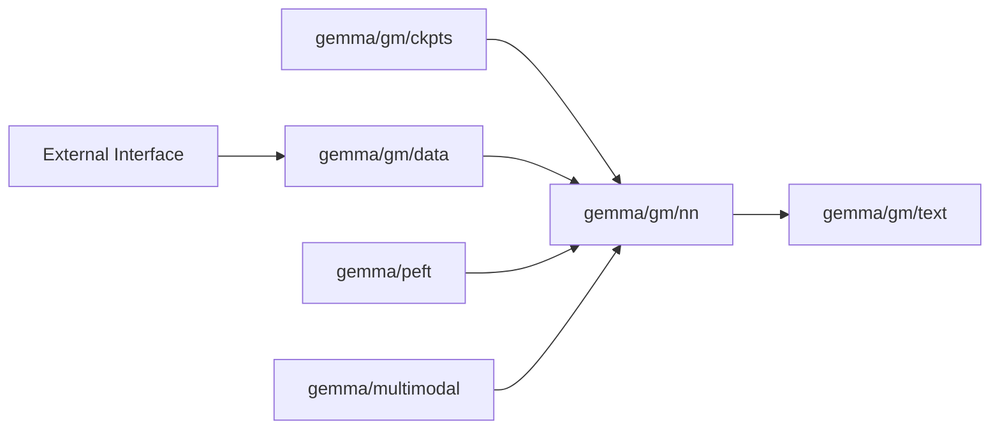

# google-deepmind/gemma

> Bibliothèque JAX officielle pour charger, échantillonner et affiner les modèles Gemma.

## Le problème
Utiliser et affiner Gemma en JAX demande de réécrire chargement de checkpoints, tokenisation et boucle d'échantillonnage.

## Ce que ça fait vraiment
Paquet `gemma` : architectures (`gm.nn.Gemma4_E4B`…), chargement des checkpoints, `ChatSampler` multi-tours.
Même API pour Gemma 2, 3, 3n et 4 ; entrées multimodales (images).
Fine-tuning, LoRA et quantification (module `peft`) ; colabs et scripts d'exemple.
Tourne sur CPU, GPU, TPU.

## Comment c'est branché


## Essayer
```bash
pip install gemma
```
(installer JAX pour CPU/GPU/TPU au préalable)

## Coût et pièges
Gratuit ; 8 Go de VRAM pour les petits modèles, 24 Go+ pour les plus gros. Poids à télécharger à part (conditions Gemma).

## Ce que ce n'est pas
Pas un serveur d'inférence ni une lib PyTorch : c'est l'écosystème JAX. 331 issues ouvertes.

## Alternatives
Aucune alternative nommée dans le README (renvoie à « d'autres implémentations » sans les citer).

## Pour toi
À surveiller : chemin officiel si tu travailles en JAX/TPU ; en PyTorch, l'écosystème Hugging Face reste plus direct.
