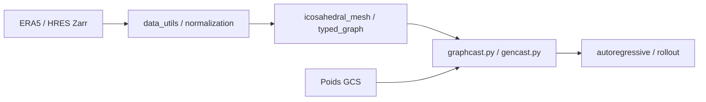

# google-deepmind/graphcast

> Code et poids des modèles météo WeatherNext (WN2, GraphCast, GenCast) pour prévoir le temps et les cyclones.

## Le problème
Les prévisions numériques classiques sont coûteuses ; des modèles appris peuvent les approcher à moindre coût.

## Ce que ça fait vraiment
Fournit le code JAX pour exécuter WeatherNext 2 et WeatherNext Cyclones (0,25°), une version Mini (1°), ainsi que GraphCast (déterministe, réseaux de graphes) et GenCast (ensembles par diffusion). Notebook Colab, poids sur un bucket Google Cloud. Recommandé sur TPU ; H100 pour les gros modèles, P100 pour le Mini.

## Comment c'est branché


## Essayer
```bash
pip install git+https://github.com/google-deepmind/weathernext.git@v0.3.0
```

## Coût et pièges
Gratuit mais matériel lourd (TPU/H100). Données ERA5/HRES sous conditions séparées. « Code de recherche, sans garantie de stabilité d'API ».

## Ce que ce n'est pas
Pas un service d'alerte officiel : le README précise que ces modèles ne remplacent pas les avis des agences météo.

## Alternatives
Flux de données quotidiens WN2 sur Google Cloud, WeatherLab et OpenMeteo, cités par le README, si tu ne veux pas exécuter le modèle.

## Pour toi
Surveiller : référence pour l'IA météo et JAX, mais coût matériel et code de recherche freinent l'usage direct.

