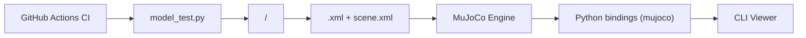

# google-deepmind/mujoco_menagerie

> Collection de modèles de robots validés pour le simulateur physique MuJoCo, pour chercheurs en robotique et RL.

## Le problème
Un simulateur n'est utile que si ses modèles se comportent correctement. Écrire un fichier MJCF fidèle pour un bras, un quadrupède ou une main demande beaucoup de réglages.

## Ce que ça fait vraiment
Chaque robot a son dossier : maillages (`assets/`), définition MJCF (`<modèle>.xml`), `scene.xml` (sol, lumière), image et parfois variantes MJX. Le catalogue couvre humanoïdes, quadrupèdes, bipèdes, bras, mains et drones. Un paquet Python `mujoco-menagerie` télécharge un modèle à la demande. La CI valide les XML et lance les tests (`model_test.py`, `mjx_model_test.py`) ; `generate_gallery.py` produit les vignettes.

## Comment c'est branché


## Essayer
```bash
git clone https://github.com/google-deepmind/mujoco_menagerie.git
python -m mujoco.viewer --mjcf mujoco_menagerie/unitree_go2/scene.xml
pip install mujoco-menagerie
uvx mujoco-menagerie view unitree_go2
```

## Coût et pièges
Gratuit. Chaque modèle a sa propre licence (BSD-3-Clause, Apache-2.0, MIT, BSD-2-Clause, BSD-3-Clause-Clear) : la licence du dépôt n'est pas identifiée par GitHub, donc vérifier modèle par modèle. La version minimale de MuJoCo est précisée dans le README de chaque modèle.

## Ce que ce n'est pas
Ce n'est pas un simulateur : il faut MuJoCo. Ce ne sont pas des politiques de contrôle entraînées, seulement des descriptions physiques. Tous les modèles n'ont pas de variante MJX (GPU).

## Alternatives
- `robot_descriptions` : paquet tiers cité par le README pour charger les mêmes modèles.

## Pour toi
À surveiller : sans intérêt hors robotique ou apprentissage par renforcement, mais si tu simules un robot sous MuJoCo ou MJX, c'est le point de départ maintenu par DeepMind, licences à contrôler.
